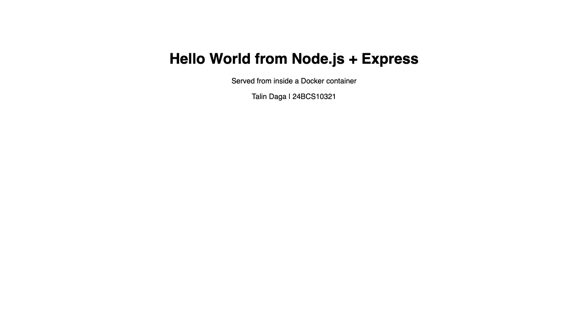
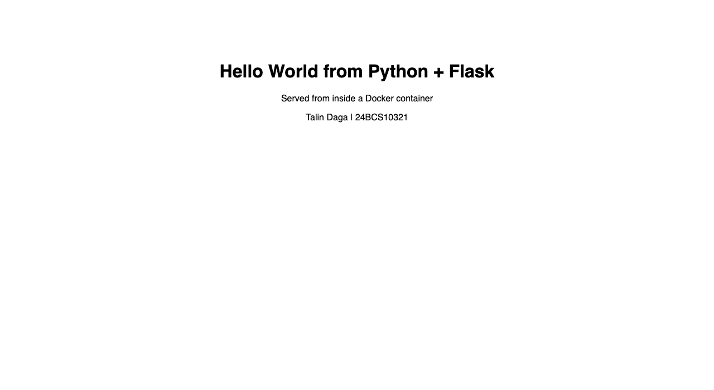
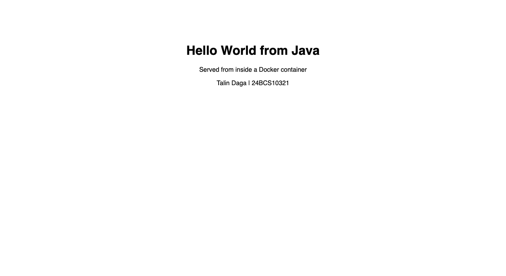
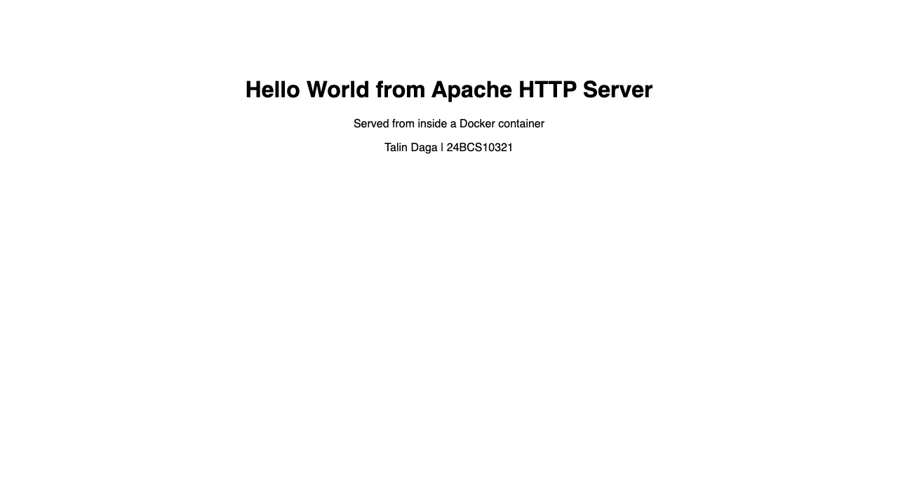
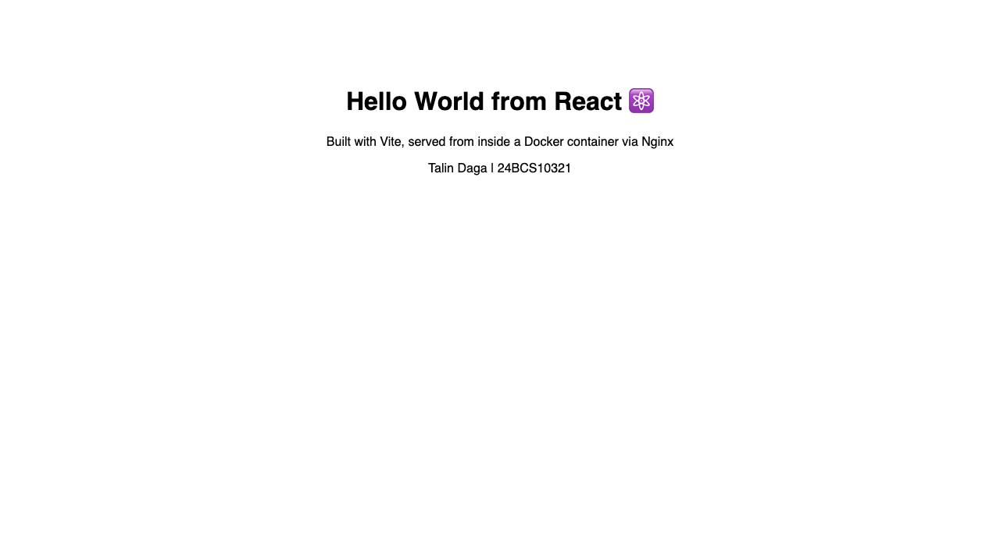
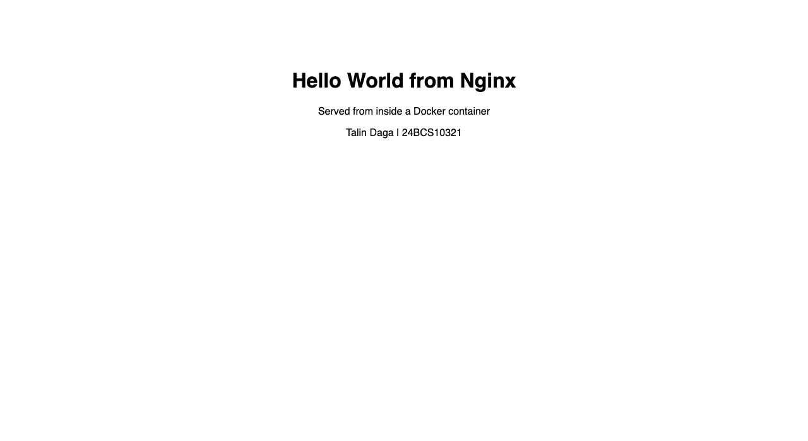

# Docker Fundamentals: Homework (Sessions 6-7)

**Name:** Talin Daga
**Enrollment No.:** 24BCS10321
**Email:** talin.24bcs10321@sst.scaler.com

**Task:** create Hello World web applications with Docker for Node.js, Python, Java, Apache, React and Nginx - each in its own folder, each with its own Dockerfile, each built, run and verified in a browser.

> Every image below was actually built and every container actually run. All output is verbatim.

---

## Folder structure

```
homework/05-docker-fundamentals/
├── nodejs-app/          Node.js + Express       → port 3000
│   ├── Dockerfile
│   ├── package.json
│   └── server.js
├── python-app/          Python + Flask          → port 5000
│   ├── Dockerfile
│   ├── requirements.txt
│   └── app.py
├── java-app/            Java (multi-stage)      → port 8080
│   ├── Dockerfile
│   └── HelloServer.java
├── Apache-app/          Apache httpd            → port 80
│   ├── Dockerfile
│   └── index.html
├── React-app/           React + Vite → Nginx    → port 80
│   ├── Dockerfile
│   ├── package.json
│   ├── vite.config.js
│   ├── index.html
│   └── src/{main.jsx, App.jsx}
└── nginx-app/           Nginx                   → port 80
    ├── Dockerfile
    └── index.html
```

## Summary

| Application | Base image | Container port | Host port | Image size | Status |
|---|---|---|---|---|---|
| Node.js + Express | `node:20-alpine` | 3000 | **3001** | 210 MB | ✅ Hello World served |
| Python + Flask | `python:3.12-slim` | 5000 | **5001** | 234 MB | ✅ Hello World served |
| Java | `eclipse-temurin:21-jdk` -> `21-jre` | 8080 | **8081** | 474 MB | ✅ Hello World served |
| Apache httpd | `httpd:2.4` | 80 | **8082** | 205 MB | ✅ Hello World served |
| React (Vite) | `node:20-alpine` -> `nginx:alpine` | 80 | **3002** | 102 MB | ✅ Hello World served |
| Nginx | `nginx:alpine` | 80 | **8083** | 102 MB | ✅ Hello World served |

---

## 1. `nodejs-app`: Node.js + Express

**Dockerfile**
```dockerfile
# ---- Node.js Hello World ----
FROM node:20-alpine

WORKDIR /app

# copy only manifest first so npm install is cached
COPY package.json ./
RUN npm install --omit=dev

COPY server.js ./

EXPOSE 3000
CMD ["node", "server.js"]
```

**server.js**
```javascript
const express = require("express");
const app = express();
const PORT = process.env.PORT || 3000;

app.get("/", (req, res) => {
  res.send(`<!doctype html>
<html>
  <head><title>Node.js Hello World</title></head>
  <body style="font-family:sans-serif;text-align:center;padding-top:80px">
    <h1>Hello World from Node.js + Express </h1>
    <p>Served from inside a Docker container</p>
    <p>Talin Daga | 24BCS10321</p>
  </body>
</html>`);
});

app.listen(PORT, "0.0.0.0", () => {
  console.log(`Node.js app listening on port ${PORT}`);
});
```

```bash
docker build -t hw-nodejs-app ./nodejs-app
docker run -d --name hw-nodejs -p 3001:3000 hw-nodejs-app
# open http://localhost:3001
```

`package.json` is copied **before** the source and `npm install` is run on its own layer, so Docker reuses the cached dependency layer whenever only `server.js` changes.

---

## 2. `python-app`: Python + Flask

**Dockerfile**
```dockerfile
# ---- Python Hello World ----
FROM python:3.12-slim

WORKDIR /app

COPY requirements.txt ./
RUN pip install --no-cache-dir -r requirements.txt

COPY app.py ./

EXPOSE 5000
CMD ["python", "app.py"]
```

**app.py**
```python
from flask import Flask

app = Flask(__name__)


@app.route("/")
def hello():
    return """<!doctype html>
<html>
  <head><title>Python Hello World</title></head>
  <body style="font-family:sans-serif;text-align:center;padding-top:80px">
    <h1>Hello World from Python + Flask </h1>
    <p>Served from inside a Docker container</p>
    <p>Talin Daga | 24BCS10321</p>
  </body>
</html>"""


if __name__ == "__main__":
    app.run(host="0.0.0.0", port=5000)
```

```bash
docker build -t hw-python-app ./python-app
docker run -d --name hw-python -p 5001:5000 hw-python-app
# open http://localhost:5001
```

Flask must bind to **`0.0.0.0`**, not `127.0.0.1`. Binding to loopback inside a container makes the app unreachable from the host even with `-p` - this is the single most common Docker beginner bug.

---

## 3. `java-app`: Java (multi-stage)

**Dockerfile**
```dockerfile
# ---- Java Hello World (multi-stage: JDK compiles, JRE runs) ----
FROM eclipse-temurin:21-jdk AS build
WORKDIR /src
COPY HelloServer.java .
RUN javac HelloServer.java

FROM eclipse-temurin:21-jre
WORKDIR /app
COPY --from=build /src/HelloServer.class .
EXPOSE 8080
CMD ["java", "HelloServer"]
```

**HelloServer.java**
```java
import com.sun.net.httpserver.HttpServer;
import java.io.OutputStream;
import java.net.InetSocketAddress;
import java.nio.charset.StandardCharsets;

public class HelloServer {
    public static void main(String[] args) throws Exception {
        int port = 8080;
        HttpServer server = HttpServer.create(new InetSocketAddress("0.0.0.0", port), 0);

        server.createContext("/", exchange -> {
            String html = "<!doctype html>"
                    + "<html><head><title>Java Hello World</title></head>"
                    + "<body style=\"font-family:sans-serif;text-align:center;padding-top:80px\">"
                    + "<h1>Hello World from Java </h1>"
                    + "<p>Served from inside a Docker container</p>"
                    + "<p>Talin Daga | 24BCS10321</p>"
                    + "</body></html>";
            byte[] body = html.getBytes(StandardCharsets.UTF_8);
            exchange.getResponseHeaders().set("Content-Type", "text/html; charset=utf-8");
            exchange.sendResponseHeaders(200, body.length);
            try (OutputStream os = exchange.getResponseBody()) {
                os.write(body);
            }
        });

        server.setExecutor(null);
        System.out.println("Java app listening on port " + port);
        server.start();
    }
}
```

```bash
docker build -t hw-java-app ./java-app
docker run -d --name hw-java -p 8081:8080 hw-java-app
# open http://localhost:8081
```

The **JDK** (compiler) is only needed to build. The final image ships the compiled `.class` on a **JRE** base, so the compiler never reaches production.

---

## 4. `Apache-app`: Apache HTTP Server

**Dockerfile**
```dockerfile
# ---- Apache (httpd) Hello World ----
FROM httpd:2.4

# httpd serves everything inside /usr/local/apache2/htdocs/
COPY index.html /usr/local/apache2/htdocs/index.html

EXPOSE 80
# base image already runs: httpd-foreground
```

```bash
docker build -t hw-apache-app ./Apache-app
docker run -d --name hw-apache -p 8082:80 hw-apache-app
# open http://localhost:8082
```

Apache serves from **`/usr/local/apache2/htdocs/`**. No `CMD` is needed - the base image already runs `httpd-foreground`.

---

## 5. `React-app`: React + Vite, served by Nginx

**Dockerfile (multi-stage)**
```dockerfile
# ---- React Hello World (multi-stage build) ----

# Stage 1: build the React app with Node
FROM node:20-alpine AS build
WORKDIR /app
COPY package.json ./
RUN npm install
COPY . .
RUN npm run build          # produces the static bundle in /app/dist

# Stage 2: serve the static bundle with Nginx (tiny final image)
FROM nginx:alpine
COPY --from=build /app/dist /usr/share/nginx/html
EXPOSE 80
```

**src/App.jsx**
```jsx
export default function App() {
  return (
    <div style={{ fontFamily: "sans-serif", textAlign: "center", paddingTop: 80 }}>
      <h1>Hello World from React ⚛️</h1>
      <p>Built with Vite, served from inside a Docker container via Nginx</p>
      <p>Talin Daga | 24BCS10321</p>
    </div>
  );
}
```

```bash
docker build -t hw-react-app ./React-app
docker run -d --name hw-react -p 3002:80 hw-react-app
# open http://localhost:3002
```

React is a **build-time** framework: `npm run build` produces plain HTML/CSS/JS in `dist/`. Node is only needed for that build, so stage 2 copies `dist/` onto `nginx:alpine`. That is why this image is **102 MB** instead of the ~400 MB it would be if Node shipped with it.

---

## 6. `nginx-app`: Nginx

**Dockerfile**
```dockerfile
# ---- Nginx Hello World ----
FROM nginx:alpine

# nginx serves everything inside /usr/share/nginx/html/
COPY index.html /usr/share/nginx/html/index.html

EXPOSE 80
# base image already runs: nginx -g 'daemon off;'
```

```bash
docker build -t hw-nginx-app ./nginx-app
docker run -d --name hw-nginx -p 8083:80 hw-nginx-app
# open http://localhost:8083
```

Nginx serves from **`/usr/share/nginx/html/`**.

---

## Build, run and verification: actual output

```console
########## DOCKER FUNDAMENTALS : BUILD, RUN & VERIFY ##########

===== Images built from the 6 Dockerfiles =====

$ docker images | grep -E 'REPOSITORY|hw-(nodejs|python|java|apache|react|nginx)-app'
REPOSITORY                             TAG                      IMAGE ID       CREATED              SIZE
hw-react-app                           latest                   110b5d75f9bf   23 seconds ago       102MB
hw-nginx-app                           latest                   5a46c9bde798   23 seconds ago       102MB
hw-apache-app                          latest                   1e9a5adaa3b2   33 seconds ago       205MB
hw-java-app                            latest                   01d5b45c96f5   33 seconds ago       474MB
hw-python-app                          latest                   fe5f6db5e308   44 seconds ago       234MB
hw-nodejs-app                          latest                   c9ff104648a8   47 seconds ago       210MB

===== Running each application =====

$ docker run -d --name hw-nodejs -p 3001:3000 hw-nodejs-app
8148afa331558c55091d08ca07131f252c165b57b0fd888d1e20214865ea51b1

$ docker run -d --name hw-python -p 5001:5000 hw-python-app
4d0c934a5f5080a720563c304338ef9c1ad41cf69bedbf0f4b9311af3a6aa11e

$ docker run -d --name hw-java   -p 8081:8080 hw-java-app
b7a57a3e72e964aab63de3cdd526e60ce06985cc4337fbf8bd321dc9957e9e92

$ docker run -d --name hw-apache -p 8082:80   hw-apache-app
8ab8f386260ad859de080515621bf89ef420576422ae185921e3e7b81646e3d0

$ docker run -d --name hw-react  -p 3002:80   hw-react-app
7d7d615123d5c3945dfcdc1f776daae534fa8ac1685fa02e8fbf500624c3a0b1

$ docker run -d --name hw-nginx  -p 8083:80   hw-nginx-app
220518cdcd7b4c74f2d36143ff950d5b1985421fa7ce07b43e7dcde57fad3a36

$ docker ps --filter 'name=hw-' --format 'table {{.Names}}	{{.Image}}	{{.Status}}	{{.Ports}}'
NAMES        IMAGE           STATUS          PORTS
hw-nginx     hw-nginx-app    Up 6 seconds    0.0.0.0:8083->80/tcp, [::]:8083->80/tcp
hw-react     hw-react-app    Up 6 seconds    0.0.0.0:3002->80/tcp, [::]:3002->80/tcp
hw-apache    hw-apache-app   Up 6 seconds    0.0.0.0:8082->80/tcp, [::]:8082->80/tcp
hw-java      hw-java-app     Up 6 seconds    0.0.0.0:8081->8080/tcp, [::]:8081->8080/tcp
hw-python    hw-python-app   Up 6 seconds    0.0.0.0:5001->5000/tcp, [::]:5001->5000/tcp
hw-nodejs    hw-nodejs-app   Up 6 seconds    0.0.0.0:3001->3000/tcp, [::]:3001->3000/tcp
hw-journal   hw-systemd      Up 54 seconds   

===== Verifying 'Hello World' is served by each container =====

$ curl -s http://localhost:3001 | grep -o 'Hello World[^<]*'
Hello World
Hello World from Node.js + Express 

$ curl -s http://localhost:5001 | grep -o 'Hello World[^<]*'
Hello World
Hello World from Python + Flask 

$ curl -s http://localhost:8081 | grep -o 'Hello World[^<]*'
Hello World
Hello World from Java 

$ curl -s http://localhost:8082 | grep -o 'Hello World[^<]*'
Hello World
Hello World from Apache HTTP Server 

$ curl -s http://localhost:3002 | grep -o '<title>[^<]*</title>'
<title>React Hello World</title>

$ curl -s http://localhost:8083 | grep -o 'Hello World[^<]*'
Hello World
Hello World from Nginx 

===== Full HTTP response headers (proof of a real web server) =====

$ curl -sI http://localhost:8081
HTTP/1.1 200 OK
Date: Thu, 03 Sep 2026 09:31:03 GMT
Content-type: text/html; charset=utf-8


$ curl -sI http://localhost:8082
HTTP/1.1 200 OK
Date: Thu, 03 Sep 2026 09:31:03 GMT
Server: Apache/2.4.68 (Unix)
Last-Modified: Thu, 03 Sep 2026 09:29:45 GMT
ETag: "12b-65a90cad4d440"
Accept-Ranges: bytes
Content-Length: 299
Content-Type: text/html


===== Container logs =====

$ docker logs hw-nodejs
Node.js app listening on port 3000

$ docker logs hw-java
Java app listening on port 8080
Sep 03, 2026 9:31:03 AM sun.net.httpserver.ExchangeImpl sendResponseHeaders
WARNING: sendResponseHeaders: being invoked with a content length for a HEAD request

$ docker logs hw-python 2>&1 | head -6
 * Serving Flask app 'app'
 * Debug mode: off
WARNING: This is a development server. Do not use it in a production deployment. Use a production WSGI server instead.
 * Running on all addresses (0.0.0.0)
 * Running on http://127.0.0.1:5000
 * Running on http://172.17.0.4:5000
```

### What this proves

* `docker ps` shows **all six containers `Up`**, each with its port mapping (`0.0.0.0:3001->3000/tcp` and so on).
* Each `curl` returned the **Hello World** line that the app renders, so the page really is being served over HTTP from inside the container.
* `curl -I` on the Apache container returns `Server: Apache/2.4.68` - the real Apache banner, not a static file being read from disk.
* `docker logs` shows each application's own startup message from inside its container.

---

## Docker commands used

| Command | Purpose |
|---|---|
| `docker build -t <name> <path>` | build an image from a Dockerfile |
| `docker images` | list local images |
| `docker run -d --name X -p H:C ` | run detached, name it, map host port H -> container port C |
| `docker ps` / `docker ps -a` | running containers / all containers |
| `docker logs <name>` | stdout/stderr of a container |
| `docker exec -it <name> sh` | shell inside a running container |
| `docker stop` / `docker start` / `docker restart` | lifecycle |
| `docker rm -f <name>` | force-remove a container |
| `docker rmi <image>` | remove an image |
| `docker system prune -a` | reclaim disk |

## Dockerfile instructions used

| Instruction | What it does |
|---|---|
| `FROM` | base image (and starts a new build stage) |
| `WORKDIR` | set (and create) the working directory |
| `COPY` | copy files from build context into the image |
| `RUN` | execute a command **at build time**, creating a layer |
| `EXPOSE` | document the port the app listens on |
| `CMD` | default command run **at container start** |
| `COPY --from=<stage>` | pull artefacts out of an earlier stage (multi-stage) |

---

## Cleanup

```bash
docker rm -f hw-nodejs hw-python hw-java hw-apache hw-react hw-nginx
docker rmi hw-nodejs-app hw-python-app hw-java-app hw-apache-app hw-react-app hw-nginx-app
```

---

## Screenshots: Hello World in the browser

Captured from the **live containers** with headless Chrome while they were running.
Each image is the page actually served by that container at the URL given.

### Node.js + Express: <http://localhost:3001>


### Python + Flask: <http://localhost:5001>


### Java: <http://localhost:8081>


### Apache HTTP Server: <http://localhost:8082>


### React + Vite (served by Nginx): <http://localhost:3002>


### Nginx: <http://localhost:8083>


All six pages render **Hello World**, confirming the requirement
*"Verify that Hello World is displayed on a webpage"* for every application.
The matching `docker ps` port mappings and `curl` responses are in the
[verification output](#build-run-and-verification-actual-output) above.
