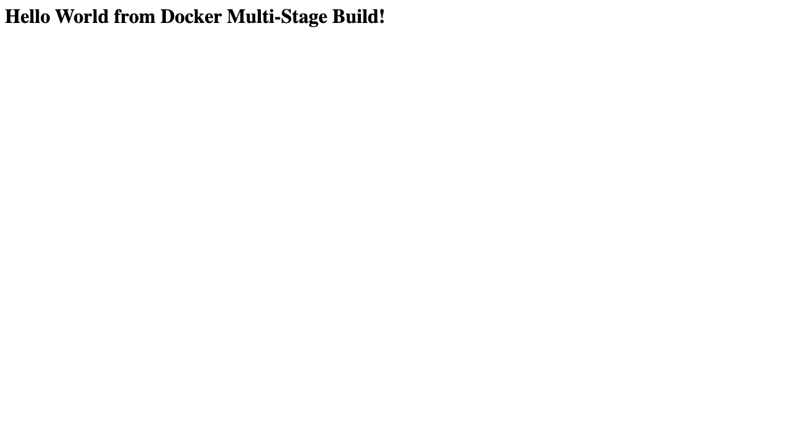

# Dockerfiles & Images: Multi-Stage Build Homework (Sessions 6-7)

**Name:** Talin Daga
**Enrollment No.:** 24BCS10321
**Email:** talin.24bcs10321@sst.scaler.com
**Date:** 03 September 2026

> Every command below was actually executed and the output pasted verbatim.

---

## Task 1: Run the multi-stage Dockerfile

The repository containing the multi-stage Dockerfile is this one. It lives at
[`session6-7-docker/multi-stage-dockerfile/`](../../session6-7-docker/multi-stage-dockerfile/).

```bash
# 1. clone the repository
git clone https://github.com/Talin12/devops-heros.git
cd devops-heros

# 2. build the image from the multi-stage Dockerfile
docker build -t multi-stage-app ./session6-7-docker/multi-stage-dockerfile

# 3. run a container, publishing it on port 8080
docker run -d --name hw-multistage -p 8080:3000 multi-stage-app

# 4. access the application
curl http://localhost:8080          # or open http://localhost:8080 in a browser

# 5. verify the running container
docker ps
```

### The Dockerfile

```dockerfile
# -------------------------
# Stage 1: Build
# -------------------------
FROM node:24-alpine AS builder
WORKDIR /app
COPY package*.json ./
RUN npm install
COPY . .

# -------------------------
# Stage 2: Production
# -------------------------
FROM node:24-alpine AS production
WORKDIR /app
COPY --from=builder /app/package*.json ./
RUN npm install --omit=dev
COPY --from=builder /app/server.js ./
EXPOSE 3000
CMD ["npm", "start"]
```

**Stage 1 (`builder`)** installs *all* dependencies and brings in the source.
**Stage 2 (`production`)** starts from a clean base and copies in only `package*.json` and `server.js`, then installs **production dependencies only** (`--omit=dev`). Everything else from the build stage - dev dependencies, caches, build tooling, source files that aren't needed at runtime - is left behind.

### Build and run: actual output

```console
########## SESSION 6-7 : MULTI-STAGE DOCKERFILE ##########

===== Task 1: build & run the multi-stage image =====

$ cat session6-7-docker/multi-stage-dockerfile/Dockerfile
# -------------------------
# Stage 1: Build
# -------------------------
FROM node:24-alpine AS builder
WORKDIR /app
COPY package*.json ./
RUN npm install
COPY . .

# -------------------------
# Stage 2: Production
# -------------------------
FROM node:24-alpine AS production
WORKDIR /app
COPY --from=builder /app/package*.json ./
RUN npm install --omit=dev
COPY --from=builder /app/server.js ./
EXPOSE 3000
CMD ["npm", "start"]
$ docker build -t multi-stage-app ./session6-7-docker/multi-stage-dockerfile
#0 building with "desktop-linux" instance using docker driver

#1 [internal] load build definition from Dockerfile
#1 DONE 0.0s

#2 [internal] load metadata for docker.io/library/node:24-alpine
#2 DONE 2.8s

#3 [internal] load .dockerignore
#3 DONE 0.0s

#4 [internal] load build context
#4 DONE 0.0s

#5 [builder 1/5] FROM docker.io/library/node:24-alpine@sha256:e67514e5d0f6c46656005e1b693b2ec9d52e80b641307de684d4a015ba7a4eaf
#5 DONE 5.8s

#5 [builder 1/5] FROM docker.io/library/node:24-alpine@sha256:e67514e5d0f6c46656005e1b693b2ec9d52e80b641307de684d4a015ba7a4eaf
#5 DONE 5.9s

#6 [builder 2/5] WORKDIR /app
#6 DONE 0.5s

#7 [builder 3/5] COPY package*.json ./
#7 DONE 0.0s

#8 [builder 4/5] RUN npm install
#8 3.715 
#8 3.715 added 68 packages, and audited 69 packages in 4s
#8 3.715 
#8 3.715 27 packages are looking for funding
#8 3.715   run `npm fund` for details
#8 3.716 
#8 3.716 found 0 vulnerabilities
#8 DONE 3.8s

#9 [builder 5/5] COPY . .
#9 DONE 0.0s

#10 [production 3/5] COPY --from=builder /app/package*.json ./
#10 DONE 0.0s

#11 [production 4/5] RUN npm install --omit=dev
#11 1.201 
#11 1.201 added 68 packages, and audited 69 packages in 1s
#11 1.201 
#11 1.201 27 packages are looking for funding
#11 1.201   run `npm fund` for details
#11 1.201 
#11 1.201 found 0 vulnerabilities
#11 DONE 1.3s

#12 [production 5/5] COPY --from=builder /app/server.js ./
#12 DONE 0.0s

#13 exporting to image
#13 exporting layers 0.1s done
#13 naming to docker.io/library/multi-stage-app:latest done
#13 unpacking to docker.io/library/multi-stage-app:latest 0.1s done
#13 DONE 0.3s

$ docker images multi-stage-app
REPOSITORY        TAG       IMAGE ID       CREATED                  SIZE
multi-stage-app   latest    a2fcb77aa4e1   Less than a second ago   243MB

$ docker run -d --name hw-multistage -p 8080:3000 multi-stage-app
c4725d7133c827d8ddc9a9a25c5f52b7897a15deae4bcc857ddf8c73135cf3ae

$ docker ps --filter name=hw-multistage
CONTAINER ID   IMAGE             COMMAND                  CREATED         STATUS         PORTS                                         NAMES
c4725d7133c8   multi-stage-app   "docker-entrypoint.s…"   5 seconds ago   Up 4 seconds   0.0.0.0:8080->3000/tcp, [::]:8080->3000/tcp   hw-multistage

===== Verify the app responds on port 8080 =====

$ curl -s http://localhost:8080
<h1>Hello World from Docker Multi-Stage Build!</h1>
$ curl -sI http://localhost:8080
HTTP/1.1 200 OK
X-Powered-By: Express
Content-Type: text/html; charset=utf-8
Content-Length: 51
ETag: W/"33-gCAsBJJtlso/BVPWoV3U/pWC3Ak"
Date: Thu, 03 Sep 2026 09:31:44 GMT
Connection: keep-alive
Keep-Alive: timeout=5


$ docker logs hw-multistage

> docker-hello-world@1.0.0 start
> node server.js

Server running on port 3000

===== Why multi-stage matters : image size comparison =====

$ docker history multi-stage-app --format 'table {{.CreatedBy}}	{{.Size}}' | head -8
CREATED BY                                      SIZE
CMD ["npm" "start"]                             0B
EXPOSE &{[{{18 0} {18 0}}] 0x400610b440}        0B
COPY /app/server.js ./ # buildkit               12.3kB
RUN /bin/sh -c npm install --omit=dev # buil…   9.45MB
COPY /app/package*.json ./ # buildkit           45.1kB
WORKDIR /app                                    8.19kB
CMD ["node"]                                    0B

$ docker images --format 'table {{.Repository}}	{{.Size}}' | grep -E 'multi-stage-app|node' | head -5
multi-stage-app                        243MB
hw-nodejs-app                          210MB
node                                   194MB
```

---

## Task 2: Documentation

| | |
|---|---|
| **Name** | Talin Daga |
| **Enrollment No.** | 24BCS10321 |
| **Email** | talin.24bcs10321@sst.scaler.com |
| **Image** | `multi-stage-app` |
| **Container** | `hw-multistage` |
| **Port** | host **8080** -> container 3000 |

### Evidence 1: the application displays the Hello World message

```console
$ curl -s http://localhost:8080
<h1>Hello World from Docker Multi-Stage Build!</h1>

$ curl -sI http://localhost:8080
HTTP/1.1 200 OK
X-Powered-By: Express
Content-Type: text/html; charset=utf-8
Content-Length: 51
ETag: W/"33-gCAsBJJtlso/BVPWoV3U/pWC3Ak"
Date: Thu, 03 Sep 2026 09:31:44 GMT
Connection: keep-alive
Keep-Alive: timeout=5
```

The `X-Powered-By: Express` header confirms this is the Express app from stage 2 actually answering, and the `200 OK` confirms the request succeeded.

### Evidence 2: `docker ps` showing the container running on port 8080

```console
$ docker ps --filter name=hw-multistage
CONTAINER ID   IMAGE             COMMAND                  CREATED         STATUS         PORTS                                         NAMES
c4725d7133c8   multi-stage-app   "docker-entrypoint.s…"   5 seconds ago   Up 4 seconds   0.0.0.0:8080->3000/tcp, [::]:8080->3000/tcp   hw-multistage
```

`0.0.0.0:8080->3000/tcp` - the container listens on 3000 internally and is **published on host port 8080**, exactly as required.

### Evidence 3: the container's own logs

```console
$ docker logs hw-multistage

> docker-hello-world@1.0.0 start
> node server.js

Server running on port 3000
```

---

## Why multi-stage builds matter: measured

To show the difference concretely, the **same React application** was built twice: once single-stage (Node ships to production) and once multi-stage (only the compiled bundle ships, served by Nginx).

**Single-stage Dockerfile** ([`size-comparison/Dockerfile.single-stage`](size-comparison/Dockerfile.single-stage)):

```dockerfile
# ---- The SAME React app, built WITHOUT multi-stage ----
# Node, npm, the whole node_modules tree and the source all ship to production.
# Build with:
#   docker build -f size-comparison/Dockerfile.single-stage \
#                -t react-single-stage ../05-docker-fundamentals/React-app
FROM node:20-alpine
WORKDIR /app
COPY package.json ./
RUN npm install
COPY . .
RUN npm run build
EXPOSE 4173
CMD ["npx", "vite", "preview", "--host", "0.0.0.0"]
```

**Multi-stage Dockerfile** ([`../05-docker-fundamentals/React-app/Dockerfile`](../05-docker-fundamentals/React-app/Dockerfile)):

```dockerfile
FROM node:20-alpine AS build
WORKDIR /app
COPY package.json ./
RUN npm install
COPY . .
RUN npm run build

FROM nginx:alpine
COPY --from=build /app/dist /usr/share/nginx/html
EXPOSE 80
```

**Result:**

```console
$ docker images --format '{{.Repository}}:{{.Tag}}  {{.Size}}' | grep -E 'react-single-stage|hw-react-app'
react-single-stage:latest  411MB
hw-react-app:latest        102MB
```

| Build | Image size | What ships to production |
|---|---|---|
| Single-stage | **411 MB** | Node runtime, npm, full `node_modules` (incl. Vite and dev deps), source code, build cache |
| Multi-stage | **102 MB** | the compiled `dist/` bundle + Nginx |

**A 4× smaller image**, and the benefits are not just disk:

* **Faster deploys** - less to push and pull on every release.
* **Smaller attack surface** - no compiler, no npm, no source code in the running container. Anything not in the image cannot be exploited in it.
* **Cleaner separation** - build tools are a build concern, not a runtime concern.

---

## Task 3: Deploy at least 3 different types of applications with Docker

Six applications were built and deployed - full source, Dockerfiles and per-app explanation in
**[`../05-docker-fundamentals/`](../05-docker-fundamentals/README.md)**.

| # | Application | Type | Base image | Host port | Status |
|---|---|---|---|---|---|
| 1 | [`nodejs-app`](../05-docker-fundamentals/nodejs-app/) | Node.js + Express | `node:20-alpine` | 3001 | ✅ |
| 2 | [`python-app`](../05-docker-fundamentals/python-app/) | Python + Flask | `python:3.12-slim` | 5001 | ✅ |
| 3 | [`java-app`](../05-docker-fundamentals/java-app/) | Java (multi-stage) | `eclipse-temurin:21` | 8081 | ✅ |
| 4 | [`Apache-app`](../05-docker-fundamentals/Apache-app/) | Apache httpd | `httpd:2.4` | 8082 | ✅ |
| 5 | [`React-app`](../05-docker-fundamentals/React-app/) | React + Vite (multi-stage) | `node` -> `nginx:alpine` | 3002 | ✅ |
| 6 | [`nginx-app`](../05-docker-fundamentals/nginx-app/) | Nginx | `nginx:alpine` | 8083 | ✅ |

### All six running at once

```console
$ docker ps --filter 'name=hw-' --format 'table {{.Names}}	{{.Image}}	{{.Status}}	{{.Ports}}'
NAMES        IMAGE           STATUS          PORTS
hw-nginx     hw-nginx-app    Up 6 seconds    0.0.0.0:8083->80/tcp, [::]:8083->80/tcp
hw-react     hw-react-app    Up 6 seconds    0.0.0.0:3002->80/tcp, [::]:3002->80/tcp
hw-apache    hw-apache-app   Up 6 seconds    0.0.0.0:8082->80/tcp, [::]:8082->80/tcp
hw-java      hw-java-app     Up 6 seconds    0.0.0.0:8081->8080/tcp, [::]:8081->8080/tcp
hw-python    hw-python-app   Up 6 seconds    0.0.0.0:5001->5000/tcp, [::]:5001->5000/tcp
hw-nodejs    hw-nodejs-app   Up 6 seconds    0.0.0.0:3001->3000/tcp, [::]:3001->3000/tcp
hw-journal   hw-systemd      Up 54 seconds
```

### All six serving Hello World

```console
$ curl -s http://localhost:3001 | grep -o 'Hello World[^<]*'
Hello World
Hello World from Node.js + Express 

$ curl -s http://localhost:5001 | grep -o 'Hello World[^<]*'
Hello World
Hello World from Python + Flask 

$ curl -s http://localhost:8081 | grep -o 'Hello World[^<]*'
Hello World
Hello World from Java 

$ curl -s http://localhost:8082 | grep -o 'Hello World[^<]*'
Hello World
Hello World from Apache HTTP Server 

$ curl -s http://localhost:3002 | grep -o '<title>[^<]*</title>'
<title>React Hello World</title>

$ curl -s http://localhost:8083 | grep -o 'Hello World[^<]*'
Hello World
Hello World from Nginx
```

---

## Multi-stage build: concepts worth remembering

| Concept | Meaning |
|---|---|
| `FROM ... AS <name>` | starts a **named** build stage |
| `COPY --from=<stage>` | copy an artefact **out of** an earlier stage |
| `COPY --from=<image>` | copy directly out of any image, e.g. `COPY --from=nginx:alpine ...` |
| `docker build --target <stage>` | build and stop at one stage - great for a "test" stage in CI |
| Layer caching | each instruction is a layer; put the rarely-changing steps (dependency install) **before** the frequently-changing ones (source copy) |
| `.dockerignore` | keeps `node_modules`, `.git`, secrets out of the build context |
| Final image contents | **only** the last stage - everything else is discarded |

### Typical interview question

> **Why use a multi-stage build?**
> To keep build-time tooling out of the runtime image. The compiler (JDK, Vite, Go toolchain, `gcc`), dev dependencies and source code are needed to *produce* the artefact, not to *run* it. Multi-stage lets you build in a fat image and ship only the artefact on a slim one - measured above as **411 MB -> 102 MB** for the same React app. Smaller images deploy faster and have a much smaller attack surface.

---

## Cleanup

```bash
docker rm -f hw-multistage
docker rmi multi-stage-app react-single-stage
```

---

## Screenshot: the application running on port 8080

Captured from the **live container** with headless Chrome at <http://localhost:8080>:



This is the page produced by the multi-stage image, served by the `hw-multistage`
container whose `docker ps` line above shows `0.0.0.0:8080->3000/tcp`.
