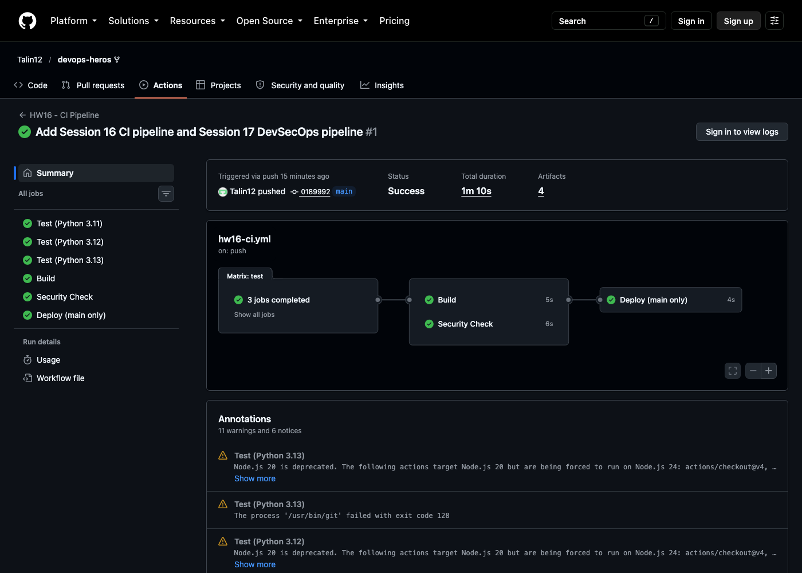

# CI/CD & GitHub Actions: Homework (Session 16)

**Name:** Talin Daga
**Enrollment No.:** 24BCS10321
**Email:** talin.24bcs10321@sst.scaler.com

> All output below is copied from the real workflow run on this repository.
> Workflow: [`.github/workflows/hw16-ci.yml`](../../.github/workflows/hw16-ci.yml) · App: [`app/`](app/) · Tests: [`tests/`](tests/)
> Run: <https://github.com/Talin12/devops-heros/actions/runs/37624243938>

---

## The pipeline

```text
                   ┌──────────── test (matrix) ────────────┐
 push / PR /       │  Python 3.11   Python 3.12   Python 3.13 │
 manual  ────────► └───────────────────┬───────────────────────┘
                                       │ needs: test
                         ┌─────────────┴─────────────┐
                         ▼                           ▼
                       build                  security-check
                  (upload artifact)       (sensitive files, secret)
                         └─────────────┬─────────────┘
                                       ▼ needs: [build, security-check]
                              deploy (main only, environment: homework-demo)
                              (download artifact, smoke test)
```



| Session topic | Where it is in the workflow |
|---|---|
| CI vs CD | `test` + `build` = CI; `deploy` consumes the built artifact = CD |
| Workflows & triggers | `push` and `pull_request` to `main`, `workflow_dispatch`, with a `paths:` filter |
| Jobs & steps | 4 jobs (6 with the matrix), dependencies through `needs:` |
| Runners | `ubuntu-latest` GitHub-hosted runners, **matrix** over 3 Python versions |
| Secrets | `secrets.GITHUB_TOKEN` passed through `env:` to authenticate an API call |
| Artifacts | `upload-artifact` in `build`, `download-artifact` in `deploy`; test reports per matrix leg |
| Build & test | `pytest -v` on every leg, `build.sh` packaging |

Because of the `paths:` filter, this workflow only runs when `homework/16-github-actions/**` or
the workflow file itself changes. Without it, every push to this shared repo would rerun it.

---

## Test job (matrix)

All three legs passed. Python 3.12 shown:

```console
platform linux -- Python 3.12.14, pytest-9.1.1, pluggy-1.6.0 -- /opt/hostedtoolcache/Python/3.12.14/x64/bin/python
tests/test_calculator.py::test_add PASSED                                [ 20%]
tests/test_calculator.py::test_subtract PASSED                           [ 40%]
tests/test_calculator.py::test_multiply PASSED                           [ 60%]
tests/test_calculator.py::test_divide PASSED                             [ 80%]
tests/test_calculator.py::test_divide_by_zero PASSED                     [100%]
============================== 5 passed in 0.03s ===============================
```

`fail-fast: false` lets every leg finish even if one fails, so a 3.13-only break shows up as
exactly that instead of cancelling the others.

## Build job

```console
Build completed successfully.
Application: Session 16 Calculator
Build Status: SUCCESS
Build Date: Wed Oct  7 12:53:27 UTC 2026
```

`build-info.txt` also gets the commit SHA (`0189992…`) and run number, so a downloaded artifact
can always be traced back to the exact commit that produced it.

## Security-check job

```console
No common sensitive files found.
authenticated API call OK - repo: Talin12/devops-heros, visibility: public
```

`GITHUB_TOKEN` is a secret GitHub creates fresh for every run and revokes when the run ends. It is
passed in through `env:` and never echoed. `gh` reads it from `GH_TOKEN` by itself. Anything that
comes from `secrets.*` is also masked as `***` if it ever shows up in the logs.

## Deploy job: uses the artifact, not the source

```console
-rw-r--r-- 1 runner runner  157 Oct  7 12:54 build-info.txt
-rw-r--r-- 1 runner runner 1488 Oct  7 12:54 calculator.py
Application: Session 16 Calculator
smoke test 10/4 = 2.5
```

The deploy job has **no checkout step**. It only sees what `build` uploaded. So what gets deployed
is the exact thing that was built and tested, not a fresh copy of the source that might have
changed. It also runs only on `main` (`if:`) and under a named `environment`, which is where
approval rules would go in a real setup.

## What I took away

- **`needs:` is the pipeline.** Without it all jobs start at once; the graph in the screenshot is
  built entirely from `needs:`.
- **Artifacts are how jobs share files.** Each job is a fresh VM, so `build/` doesn't exist in
  `deploy` unless it is uploaded and downloaded.
- **Path filters matter in a monorepo.** This repo holds 20+ sessions, and without `paths:` every
  commit would run every pipeline.
