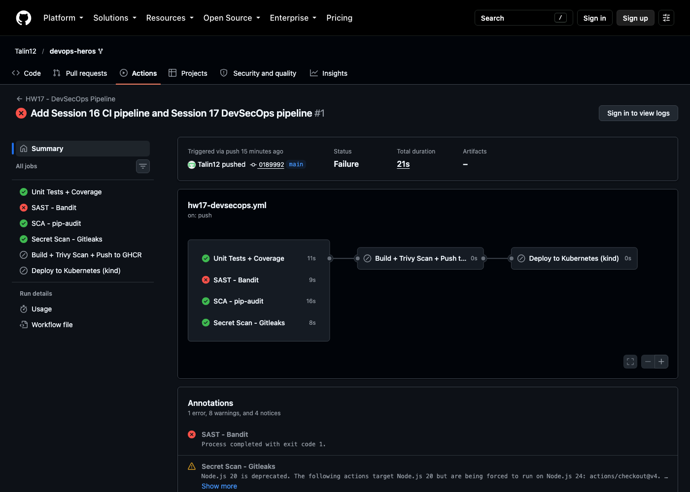
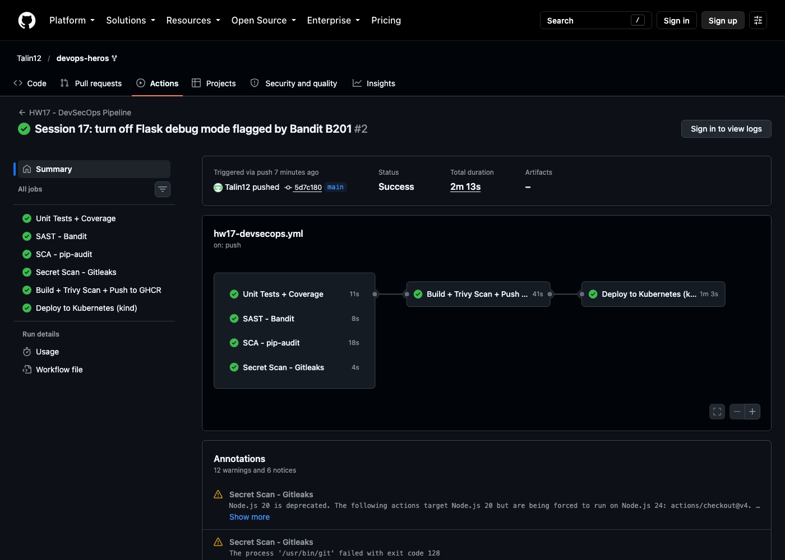

# Complete CI/CD & DevSecOps: Homework (Session 17)

**Name:** Talin Daga
**Enrollment No.:** 24BCS10321
**Email:** talin.24bcs10321@sst.scaler.com

> All output below is copied from real workflow runs on this repository.
> Workflow: [`.github/workflows/hw17-devsecops.yml`](../../.github/workflows/hw17-devsecops.yml) · App: [`app/`](app/) · [`Dockerfile`](Dockerfile) · [`k8s/`](k8s/)
> Blocked run: <https://github.com/Talin12/devops-heros/actions/runs/37624244016> · Green run: <https://github.com/Talin12/devops-heros/actions/runs/37625195630>

---

## The pipeline

```text
  ┌─ Unit Tests + Coverage (≥65%) ─┐
  ├─ SAST       - Bandit           ┤   all four must pass
  ├─ SCA        - pip-audit        ┤ ───────────────────────► Build image
  └─ Secrets    - Gitleaks         ┘                           ├─ verify non-root user
                                                               ├─ Trivy report (HIGH+CRITICAL)
                                                               ├─ Trivy GATE (fixable CRITICAL)
                                                               └─ push to GHCR (sha + latest)
                                                                        │
                                                                        ▼
                                                  Deploy to kind: pull that exact sha,
                                                  rollout, smoke-test /api/status
```

| Session topic | Implementation |
|---|---|
| Container registry | GitHub Container Registry, `ghcr.io/talin12/devops-heros-hw17`, pushed with `GITHUB_TOKEN` |
| Kubernetes deployment | kind cluster in the runner, image side-loaded, `kubectl rollout status` + curl |
| SAST | **Bandit**, gate on HIGH severity |
| SCA | **pip-audit** against `requirements.txt` |
| Secret scanning | **Gitleaks** (`dir` mode, scoped to this folder) |
| Container image scanning | **Trivy**, full HIGH/CRITICAL report + gate on fixable CRITICAL |
| Security gates | `needs: [test, sast, sca, secret-scan]`, so the image is never built if any of them fail |

---

## Run 1: the gate blocked a real vulnerability

I pushed the session's demo app as given. The SAST gate failed, and **nothing was built, pushed
or deployed**:



```console
>> Issue: [B201:flask_debug_true] A Flask app appears to be run with debug=True, which exposes the Werkzeug debugger and allows the execution of arbitrary code.
   Severity: High   Confidence: Medium
   CWE: CWE-94 (https://cwe.mitre.org/data/definitions/94.html)
   More Info: https://bandit.readthedocs.io/en/1.9.4/plugins/b201_flask_debug_true.html
   Location: app/app.py:234:4
233	if __name__ == "__main__":
234	    app.run(host="0.0.0.0", port=5001, debug=True)
```

This is a genuine finding, not a lint nitpick. The container's `CMD` is `python app/app.py`, so
this line **is** the production entrypoint. With `debug=True` and `host="0.0.0.0"`, anyone who can
reach port 5001 and trigger an error gets the Werkzeug interactive debugger, which is a Python
shell in the container.

### The fix

```python
    # Debug mode exposes the Werkzeug debugger (remote code execution), so it is
    # opt-in for local development only and always off in the container.
    debug = os.environ.get("FLASK_DEBUG", "0") == "1"
    app.run(host="0.0.0.0", port=5001, debug=debug)  # nosec B104 - must bind all interfaces inside a container
```

`# nosec B104` suppresses only the *medium* "binds to all interfaces" warning, with the reason on
the same line. Inside a container, binding `0.0.0.0` is required, or the port mapping can't reach
the app. Suppressing a finding with a written reason is very different from turning the scanner
off.

## Run 2: everything green



```text
Unit Tests + Coverage: success  (13:00:49-13:01:00)
Secret Scan - Gitleaks: success  (13:00:49-13:00:53)
SAST - Bandit: success  (13:00:49-13:00:57)
SCA - pip-audit: success  (13:00:49-13:01:07)
Build + Trivy Scan + Push to GHCR: success  (13:01:10-13:01:51)
Deploy to Kubernetes (kind): success  (13:01:54-13:02:57)
```

The four gates ran **in parallel**, all starting at 13:00:49. The image job started only after the
slowest one (pip-audit) finished.

### Tests + coverage

```console
app/app.py          103     33    68%   94, 104-105, 121, 128, 132-133, 145, 179-209, 225, 230, 236-237
TOTAL               103     33    68%
Required test coverage of 65% reached. Total coverage: 67.96%
```

I set the threshold to 65% because the existing suite reaches 68%. The point of a coverage gate is
to stop it from *dropping*, and an 80% target would have failed on day one and been switched off.

### SAST after the fix

```console
Run metrics:
	Total issues (by severity):
		Undefined: 0
		Low: 5
		Medium: 0
		High: 0
```

### SCA

```console
No known vulnerabilities found
```

### Secret scan

```console
1:00PM INF scanned ~42884 bytes (42.88 KB) in 16.1ms
1:00PM INF no leaks found
```

Gitleaks is scoped to this folder on purpose. This repo also holds the course's Kubernetes
`Secret` examples (deliberate demo credentials from Session 12), which would fail every run.

### Image: non-root, Trivy, push

```console
uid=10001(appuser) gid=10001(appuser) groups=10001(appuser)
```

```console
ghcr.io/talin12/devops-heros-hw17:5d7c1801593ef55ec8009210347b0538b45a6f35 (debian 13.7)
========================================================================================
Total: 44 (HIGH: 44, CRITICAL: 0)
┌───────────────┬────────────────┬──────────┬──────────────┬───────────────────────────────────┬───────────────┬─────────────────────────────────────────────────────────────┐
│    Library    │ Vulnerability  │ Severity │    Status    │         Installed Version         │ Fixed Version │                            Title                            │
├───────────────┼────────────────┼──────────┼──────────────┼───────────────────────────────────┼───────────────┼─────────────────────────────────────────────────────────────┤
│ bsdutils      │ CVE-2026-76642 │ HIGH     │ affected     │ 1:2.41.5-0+deb13u1                │               │ util-linux: util-linux: failed external mount helper still  │
│               │                │          │              │                                   │               │ runs privileged X-mount post-hooks                          │
...
```

**44 HIGH, 0 CRITICAL, all in the Debian base image, and every one shows status `affected` with no
fixed version.** There is no upgrade that removes them today. So the gate is
`--severity CRITICAL --ignore-unfixed --exit-code 1`: fail on anything critical that *can* be
fixed. Gating on "zero HIGH" would block every build on problems nobody can act on yet, and the
team would soon turn the gate off. The full report still prints on every run, so they stay
visible. All 8 Python packages scanned clean.

```console
Login Succeeded
5d7c1801593ef55ec8009210347b0538b45a6f35: digest: sha256:b5598df529c90274c33d949c38070424ef41310786952471b43ecae3fe4c8945 size: 2200
latest: digest: sha256:b5598df529c90274c33d949c38070424ef41310786952471b43ecae3fe4c8945 size: 2200
```

Same digest for both tags. `latest` is just a second name for the commit-SHA image.

### Deploy + smoke test

```console
Status: Downloaded newer image for ghcr.io/talin12/devops-heros-hw17:5d7c1801593ef55ec8009210347b0538b45a6f35
deployment "session17-python" successfully rolled out
session17-python-7f88b8b79c-4gp2s   1/1     Running   0          1s    10.244.0.5   chart-testing-control-plane   <none>           <none>
session17-python-7f88b8b79c-7dzxh   1/1     Running   0          1s    10.244.0.6   chart-testing-control-plane   <none>           <none>
{"app":"DevSecOps Dashboard","platform":"Linux","python_version":"3.12.15","status":"running","timestamp":"2026-10-07T13:02:49.783333Z","total_requests":1,"uptime":"00h 00m 03s","version":"2.0.0"}
<title>DevSecOps Dashboard | Session 17</title>
```

Deploy pulls by **commit SHA**, never `latest`, so the pods run exactly the image that passed the
scans.

## Changes I made to the session demo

| Change | Why |
|---|---|
| `debug=True` → env-controlled, off by default | Bandit B201: remote code execution through the Werkzeug debugger |
| `USER appuser` (uid 10001) in the Dockerfile | Container no longer runs as root |
| `.dockerignore` | Keeps tests, `k8s/`, caches and `.coverage` out of the image |
| Docker Hub → GHCR with `GITHUB_TOKEN` | No long-lived registry password stored as a secret |
| `imagePullPolicy: Always` → `IfNotPresent` | The image is side-loaded into kind, so there's no pull |
| Gitleaks + Bandit added; CodeQL replaced by Bandit | Faster SAST, plus the secret-scanning stage the session covers |

## What I took away

- **The first run failing was the most useful result.** The gate stopped a debug-mode app from
  reaching a registry or a cluster, which is exactly what a gate is for.
- **A gate has to be one the team can pass.** "Zero HIGH" on a Debian base image blocks every
  build, so it gets switched off. "Zero fixable CRITICAL" plus a visible full report actually
  gets enforced.
- **Deploy the digest you scanned.** Building once, scanning that image, and pulling it by SHA is
  what connects the scan results to what is actually running.
