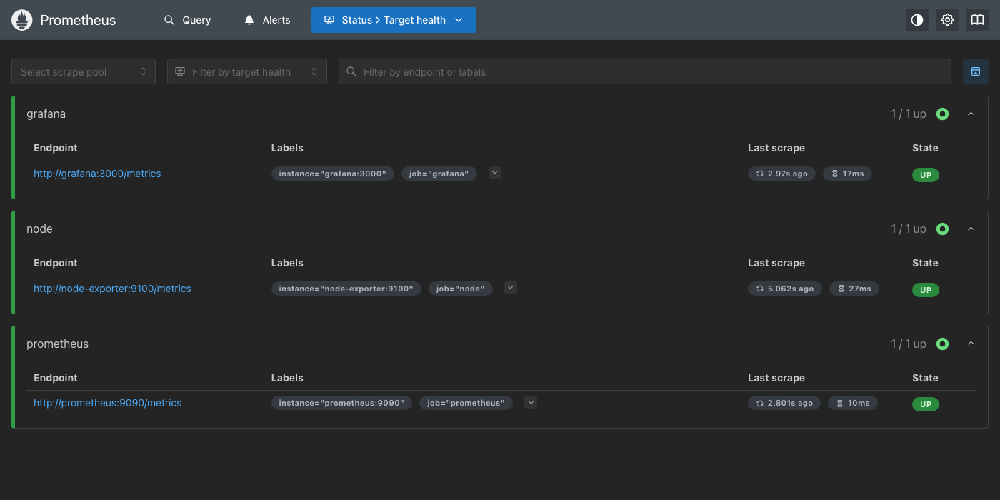
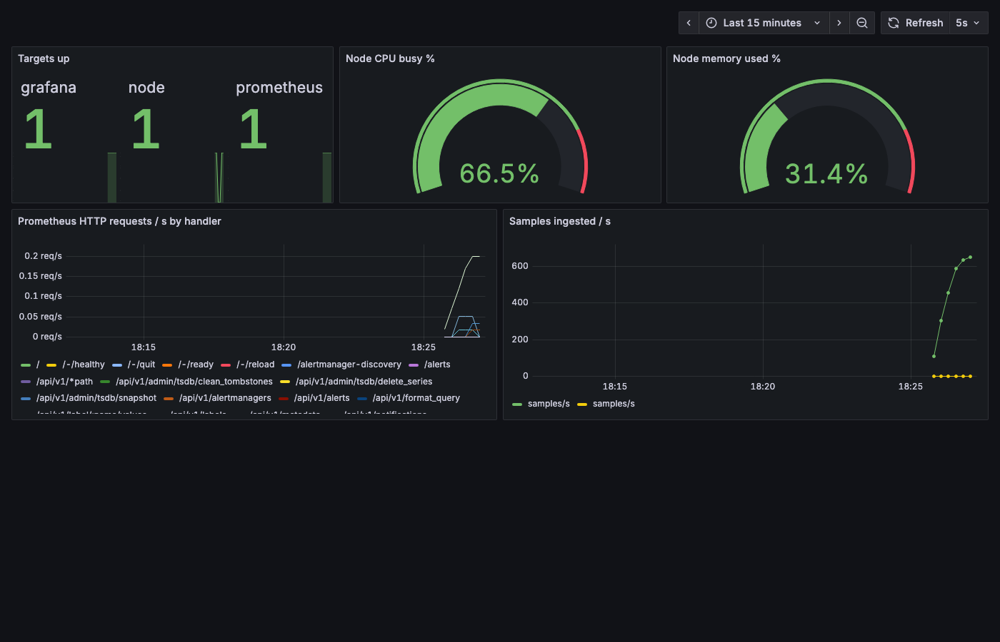
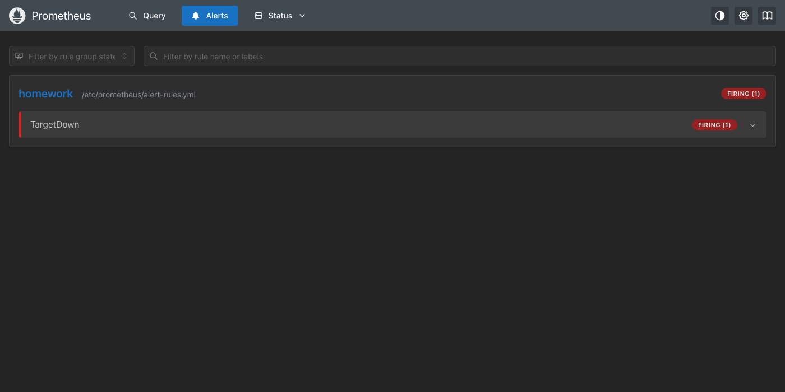

# Monitoring, Observability & GitOps: Homework (Session 20)

**Name:** Talin Daga
**Enrollment No.:** 24BCS10321
**Email:** talin.24bcs10321@sst.scaler.com

> Every command below was actually executed and the output pasted verbatim. Screenshots are real
> browser captures of the running stack.
> Monitoring stack: [`monitoring/`](monitoring/) · GitOps app: [`gitops/`](gitops/)

---

## Part A: Prometheus + Grafana

[`monitoring/docker-compose.yml`](monitoring/docker-compose.yml) runs three containers:

| Container | Role |
|---|---|
| `prom/prometheus:v3.5.0` | Scrapes every 5s; loads [`alert-rules.yml`](monitoring/alert-rules.yml) |
| `prom/node-exporter:v1.9.1` | Host metrics: CPU, memory, disk |
| `grafana/grafana:12.1.1` | Datasource **and** dashboard provisioned from files, so there's no clicking around the UI |

```console
$ docker compose ps
NAME                 IMAGE                       COMMAND                  SERVICE         CREATED          STATUS          PORTS
hw20-grafana         grafana/grafana:12.1.1      "/run.sh"                grafana         30 seconds ago   Up 29 seconds   0.0.0.0:3000->3000/tcp, [::]:3000->3000/tcp
hw20-node-exporter   prom/node-exporter:v1.9.1   "/bin/node_exporter"     node-exporter   30 seconds ago   Up 30 seconds   9100/tcp
hw20-prometheus      prom/prometheus:v3.5.0      "/bin/prometheus --c…"   prometheus      30 seconds ago   Up 30 seconds   0.0.0.0:9090->9090/tcp, [::]:9090->9090/tcp

$ curl -s localhost:9090/api/v1/targets | python3 -c "..."
grafana      up    http://grafana:3000/metrics
node         up    http://node-exporter:9100/metrics
prometheus   up    http://prometheus:9090/metrics

$ curl -s 'localhost:9090/api/v1/query' --data-urlencode 'query=up' | python3 -c "..."
node         1
grafana      1
prometheus   1

$ curl -s 'localhost:9090/api/v1/query' --data-urlencode 'query=round(100 * (1 - node_memory_MemAvailable_bytes / node_memory_MemTotal_bytes), 0.1)' | python3 -c "..."
node memory used %: 30.8
```

Prometheus **pulls**: each target only exposes `/metrics`, and Prometheus reaches them by their
compose service names. `up` is a metric Prometheus creates itself for every scrape: 1 if the scrape
worked, 0 if it didn't.



### Grafana, fully provisioned

```console
$ curl -s localhost:3000/api/health
{
  "database": "ok",
  "version": "12.1.1",
  "commit": "df5de8219b41d1e639e003bf5f3a85913761d167"
}
$ curl -s localhost:3000/api/datasources/uid/prometheus/health -u admin:admin
{"details":{"application":"Prometheus","features":{"rulerApiEnabled":false}},"message":"Successfully queried the Prometheus API.","status":"OK"}
$ curl -s 'localhost:3000/api/search?query=Homework' -u admin:admin | python3 -m json.tool | grep -E 'title|url'
        "title": "Homework",
        "url": "/dashboards/f/fg0iests7negwb/homework",
        "title": "Homework 20 - Stack Overview",
        "url": "/d/hw20-overview/homework-20-stack-overview",
```

The datasource and dashboard both come from files under
[`monitoring/grafana/`](monitoring/grafana/). Deleting the Grafana container loses nothing, because
it rebuilds the same dashboard on start. That is the dashboard version of infrastructure as code.



| Panel | PromQL |
|---|---|
| Targets up | `up` |
| Node CPU busy % | `100 * (1 - avg(rate(node_cpu_seconds_total{mode="idle"}[1m])))` |
| Node memory used % | `100 * (1 - node_memory_MemAvailable_bytes / node_memory_MemTotal_bytes)` |
| HTTP requests/s by handler | `sum by (handler) (rate(prometheus_http_requests_total[1m]))` |
| Samples ingested/s | `rate(prometheus_tsdb_head_samples_appended_total[1m])` |

`rate()` on the counters: a counter only goes up, so the raw value is meaningless on its own.
The per-second rate over a window is the useful number.

### An alert that actually fires

```yaml
- alert: TargetDown
  expr: up == 0
  for: 15s
```

```console
$ docker stop hw20-node-exporter
hw20-node-exporter

$ curl -s localhost:9090/api/v1/alerts | python3 -c "..."
TargetDown node firing - node target is down
```



`for: 15s` means the condition has to stay true for 15 seconds first. One missed scrape puts the
alert in `pending`, not `firing`, so it doesn't page anyone over a single blip.

### Monitoring vs observability, metrics/logs/traces

- **Monitoring** answers questions you knew to ask in advance: the `TargetDown` rule above.
- **Observability** is being able to ask *new* questions of a running system without shipping new
  code. It needs all three signals: **metrics** (cheap numbers over time: *is* something wrong?),
  **logs** (events with detail: *what* happened?), and **traces** (one request across services:
  *where* did the time go?).

---

## Part B: GitOps with Argo CD

```text
  git push ──► github.com/Talin12/devops-heros
                 homework/20-monitoring-gitops/gitops/app/   ◄── desired state
                         │  polled by
                         ▼
                 Argo CD (minikube, ns argocd)  ── automated sync, prune, selfHeal
                         │  applies
                         ▼
                 ns session20: Deployment + Service          ◄── actual state
```

The `Application` ([`gitops/argocd-application.yaml`](gitops/argocd-application.yaml)) points at
**this repository**. It lives outside the `app/` path, so Argo CD doesn't manage the object that
tells it what to manage.

```console
$ kubectl get pods -n argocd
NAME                                                READY   STATUS    RESTARTS   AGE
argocd-application-controller-0                     1/1     Running   0          2m18s
argocd-applicationset-controller-76fd8cdd4f-hpnl4   1/1     Running   0          2m19s
argocd-dex-server-66c78cf887-g4zqw                  1/1     Running   0          2m19s
argocd-notifications-controller-7fb9868fd6-cmqpj    1/1     Running   0          2m19s
argocd-redis-bdbdffcb4-2fzcq                        1/1     Running   0          2m19s
argocd-repo-server-d89c7967d-kpjnd                  1/1     Running   0          2m18s
argocd-server-776b7cdd4d-9jckv                      1/1     Running   0          2m18s

$ kubectl apply -f argocd-application.yaml
application.argoproj.io/session20-mini created

$ kubectl get applications -n argocd
NAME             SYNC STATUS   HEALTH STATUS
session20-mini   Synced        Healthy

$ kubectl get all -n session20
NAME                                  READY   STATUS    RESTARTS   AGE
pod/session20-mini-68946db7dd-hzjxq   1/1     Running   0          34s
pod/session20-mini-68946db7dd-xgbk7   1/1     Running   0          34s

NAME                     TYPE        CLUSTER-IP      EXTERNAL-IP   PORT(S)   AGE
service/session20-mini   ClusterIP   10.111.217.81   <none>        80/TCP    34s

NAME                             READY   UP-TO-DATE   AVAILABLE   AGE
deployment.apps/session20-mini   2/2     2            2           34s

NAME                                        DESIRED   CURRENT   READY   AGE
replicaset.apps/session20-mini-68946db7dd   2         2         2       34s

$ kubectl get application session20-mini -n argocd -o jsonpath='revision={.status.sync.revision}{"\n"}'
revision=4e96876e4fe95adb5f46c7a6ceabb1e8f7cea57c
```

I never ran `kubectl apply` on the app manifests. The `session20` namespace (via
`CreateNamespace=true`), the Deployment and the Service were all created by Argo CD from commit
`4e96876`.

### Self-heal: a manual change is reverted

```console
$ kubectl scale deployment session20-mini -n session20 --replicas=5
deployment.apps/session20-mini scaled

18:34:04  session20-mini   2/5   5     2     47s
18:34:06  session20-mini   2/2   2     2     49s
18:34:08  session20-mini   2/2   2     2     51s
```

Within about 2 seconds Argo CD saw the live Deployment differ from Git and put it back to 2. With
`selfHeal: true`, **Git wins over `kubectl`**. The only lasting way to change the cluster is a
commit.

### The Git change: 2 → 3 replicas

```console
$ sed -i '' 's/replicas: 2/replicas: 3/' homework/20-monitoring-gitops/gitops/app/deployment.yaml && git diff ...
-  replicas: 2
+  replicas: 3

$ git add ... && git commit -q -m 'Session 20: scale GitOps app to three replicas' && git push origin main
   4e96876..be29410  main -> main
be294107042b1a35d5894370310790af9095e86f

$ kubectl get deployment session20-mini -n session20 -w   (sampled every 10s, no manual sync)
18:34:20  session20-mini   2/2   2     2     63s
18:35:21  session20-mini   2/2   2     2     2m4s
18:36:22  session20-mini   2/2   2     2     3m5s
18:37:12  session20-mini   2/2   2     2     3m56s
18:37:23  session20-mini   3/3   3     3     4m6s

$ kubectl get applications -n argocd
NAME             SYNC STATUS   HEALTH STATUS
session20-mini   Synced        Healthy

$ kubectl get application session20-mini -n argocd -o jsonpath='{range .status.history[*]}{.id}  {.revision}  {.deployedAt}{"\n"}{end}'
0  4e96876e4fe95adb5f46c7a6ceabb1e8f7cea57c  2026-10-07T13:03:17Z
1  be294107042b1a35d5894370310790af9095e86f  2026-10-07T13:07:16Z
```

(Repeated identical 10-second samples are trimmed.)

**About 3 minutes from push to 3/3, with no command run against the cluster.** That delay is Argo
CD's repository polling. `timeout.reconciliation` is not set in this install's `argocd-cm`, so the
default applies: 120s plus up to 60s of jitter. A Git webhook would make
it near-instant. The self-heal above was fast because comparing against the *cluster* is
event-driven; only fetching from *Git* is polled.

The history lists both deployed commits with timestamps: an audit log of every change to
production, where the "who" and "why" are the Git commit.

### Cleanup

```bash
kubectl delete -f gitops/argocd-application.yaml   # prune removes the app objects
docker compose -f monitoring/docker-compose.yml down
```

## What I took away

- **Grafana can be code too.** A provisioned datasource and dashboard rebuild themselves on start.
- **An alert needs a `for:`.** Without it, one dropped scrape would page someone.
- **In GitOps the cluster stops being something you edit.** My `kubectl scale` lasted 2 seconds; the
  commit lasted. The repository becomes the only real control.
