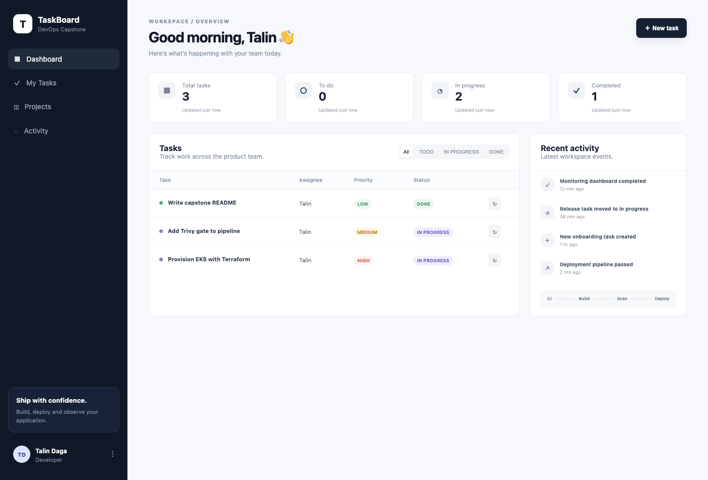
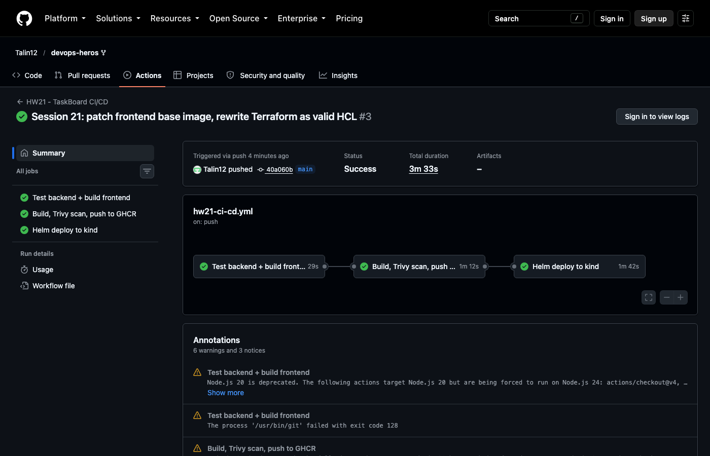
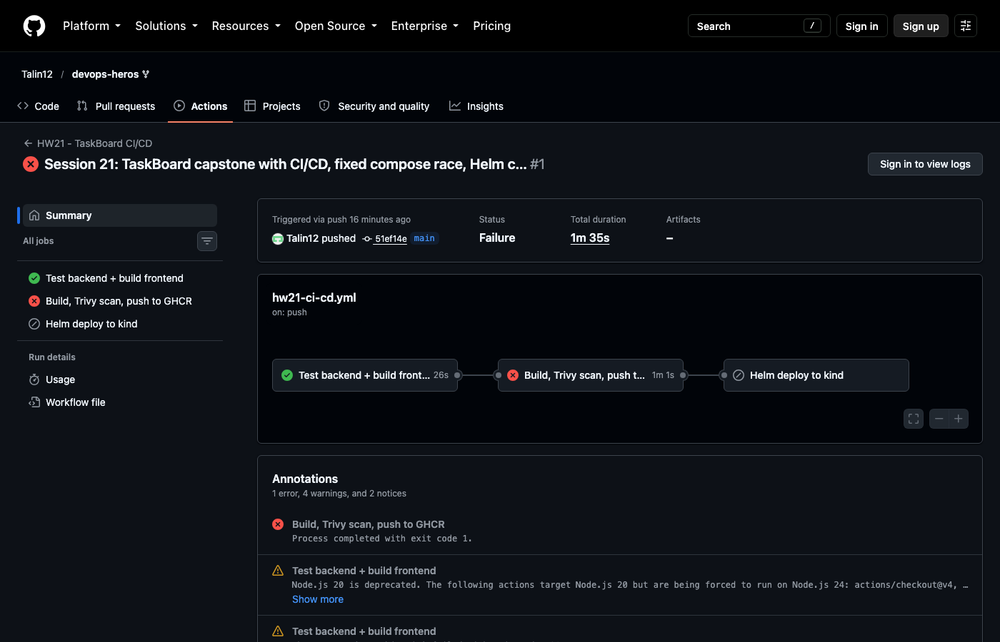
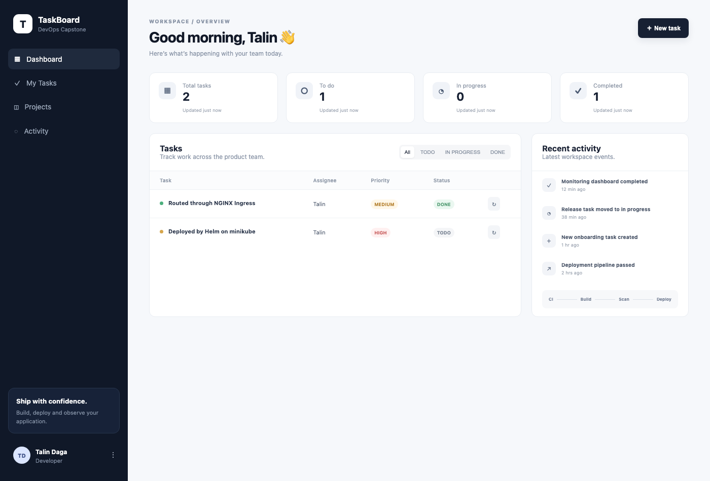
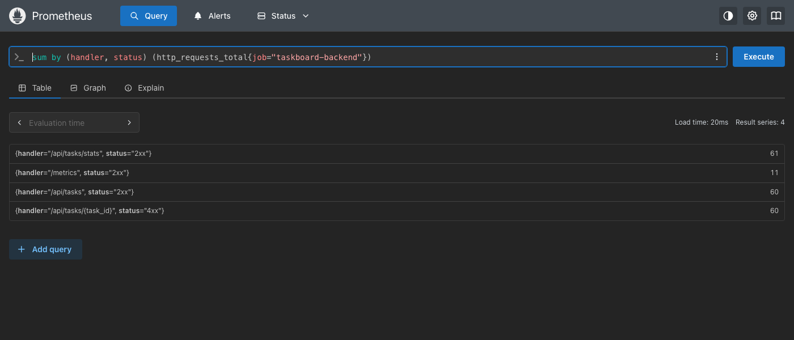

# Final DevOps Project & Troubleshooting: TaskBoard Capstone (Session 21)

**Name:** Talin Daga
**Enrollment No.:** 24BCS10321
**Email:** talin.24bcs10321@sst.scaler.com

> Every command below was actually executed and the output pasted verbatim; pipeline output is
> copied from real GitHub Actions runs. Screenshots are real browser captures.
> Pipeline: [`.github/workflows/hw21-ci-cd.yml`](../../.github/workflows/hw21-ci-cd.yml) ·
> Green run: <https://github.com/Talin12/devops-heros/actions/runs/37629139375>

A three-tier task board: **React (Vite) + Nginx** frontend, **FastAPI** backend, **PostgreSQL**
with **Alembic** migrations. It is tested, containerised, scanned, published to GHCR, deployed with
Helm, described in Terraform and scraped by Prometheus.

```text
 git push ─► GitHub Actions ─► pytest + vite build ─► docker build ×2 ─► Trivy gate ─► GHCR (:sha)
                                                                                   │
                                                              kind + helm upgrade --install ◄┘
 Browser ─► Ingress (taskboard.local) ─┬─ /     ─► taskboard-frontend (nginx, uid 101) ×2
                                       └─ /api  ─► taskboard-backend  (uvicorn, uid 10001) ×2 ─► postgres (PVC)
                                                         │ /metrics
                                                    Prometheus
```

## Module checklist

| Module | Evidence in this README |
|---|---|
| M1 App: frontend + backend + DB | [§1](#1-application-docker-compose): 4 CRUD verbs, Alembic migration, UI screenshot |
| M2 Testing | [§2](#2-tests): 9 pytest cases, throwaway SQLite DB via `conftest.py` |
| M3 Git | [§3](#3-git): commit history, `.gitignore` |
| M4 Docker | [§1](#1-application-docker-compose): multi-stage frontend, both images non-root, one-command compose |
| M5 CI/CD | [§4](#4-cicd-pipeline): push-triggered, pytest + frontend build, SHA-tagged images pushed to GHCR |
| M6 DevSecOps | [§5](#5-devsecops-trivy-blocked-the-pipeline-twice): Trivy failed the build twice on real CVEs; both fixed |
| M7 Terraform | [§6](#6-terraform-vpc--eks): VPC (2 public + 2 private subnets) + EKS + node group, plan → apply → destroy |
| M8 Kubernetes + Helm | [§7](#7-kubernetes--helm): 2+2 replicas, ClusterIP services, Ingress `/` and `/api`, browser via Ingress |
| M9 Observability | [§8](#8-observability): `/metrics`, Prometheus scrape, PromQL, ServiceMonitor |
| M10 Docs | This README, plus the [bugs I found and fixed](#bugs-found-and-fixed) |

---

## 1. Application (Docker Compose)

Before it would start, the provided `docker-compose.yml` had a bug. The backend crashed on
its very first boot:

```console
backend-1  | sqlalchemy.exc.OperationalError: (psycopg.OperationalError) connection failed: connection to server at "172.20.0.2", port 5432 failed: Connection refused
backend Exited (1) 34 seconds ago
```

`depends_on: [postgres]` waits for the Postgres container to *start*, not for Postgres to *accept
connections*. The backend runs `alembic upgrade head` first, so it lost the race and exited. The fix
is a healthcheck plus `condition: service_healthy`:

```console
$ diff -u compose-orig.yml docker-compose.yml
+    # "started" is not "ready": without this the backend's migration races the DB.
+    healthcheck:
+      test: ["CMD-SHELL", "pg_isready -U taskboard -d taskboard"]
+      interval: 3s
+      timeout: 3s
+      retries: 20
...
     depends_on:
-      - postgres
+      postgres:
+        condition: service_healthy
+    restart: unless-stopped

$ docker compose -p hw21 up --build -d 2>&1 | grep -E 'Healthy|Started|Built|Waiting'
 hw21-frontend  Built
 hw21-backend  Built
 Container hw21-postgres-1  Started
 Container hw21-postgres-1  Waiting
 Container hw21-postgres-1  Healthy
 Container hw21-backend-1  Started
 Container hw21-frontend-1  Started
```

```console
$ docker compose -p hw21 logs backend | grep -E 'Running upgrade|Uvicorn running|startup complete'
backend-1  | INFO  [alembic.runtime.migration] Running upgrade  -> 0001_create_tasks
backend-1  | INFO:     Application startup complete.
backend-1  | INFO:     Uvicorn running on http://0.0.0.0:8000 (Press CTRL+C to quit)

$ curl -s localhost:8000/health; echo
{"status":"UP"}

$ curl -s -X POST localhost:8000/api/tasks -H 'Content-Type: application/json' -d '{"title":"Provision EKS with Terraform","priority":"HIGH","assignee":"Talin"}'; echo
{"title":"Provision EKS with Terraform","description":"","priority":"HIGH","status":"TODO","assignee":"Talin","id":1,"created_at":"2026-10-07T13:14:14.249435Z"}

$ curl -s -X PUT localhost:8000/api/tasks/1 -H 'Content-Type: application/json' -d '{"status":"IN_PROGRESS"}'; echo
{"title":"Provision EKS with Terraform","description":"","priority":"HIGH","status":"IN_PROGRESS","assignee":"Talin","id":1,"created_at":"2026-10-07T13:14:14.249435Z"}

$ curl -s -X POST localhost:8000/api/tasks -H 'Content-Type: application/json' -d '{"title":"temp"}' >/dev/null; curl -s -o /dev/null -w 'DELETE /api/tasks/4 -> %{http_code}\n' -X DELETE localhost:8000/api/tasks/4
DELETE /api/tasks/4 -> 204

$ curl -s localhost:3000/api/tasks/stats; echo
{"total":3,"todo":0,"inProgress":2,"done":1}

$ docker compose -p hw21 exec postgres psql -U taskboard -d taskboard -c 'select version_num from alembic_version;' -c 'select id, title, status, priority from tasks order by id;'
    version_num
-------------------
 0001_create_tasks
(1 row)

 id |            title             |   status    | priority
----+------------------------------+-------------+----------
  1 | Provision EKS with Terraform | IN_PROGRESS | HIGH
  2 | Add Trivy gate to pipeline   | IN_PROGRESS | MEDIUM
  3 | Write capstone README        | DONE        | LOW
(3 rows)
```

The last `stats` call goes through **port 3000**, the frontend's Nginx, which proxies `/api/` to the
backend.



### Both images are non-root

```console
$ docker compose -p hw21 exec backend id
uid=10001(appuser) gid=10001(appuser) groups=10001(appuser)

$ docker compose -p hw21 exec frontend sh -c 'id; ps -o user,comm | head -3'
uid=101(nginx) gid=101(nginx) groups=101(nginx)
USER     COMMAND
nginx    nginx
nginx    nginx
```

The provided frontend used `nginx:1.27-alpine`, whose master process runs as **root**
(`ps` showed `root nginx` before my change). I moved it to `nginxinc/nginx-unprivileged`, which
listens on 8080 as uid 101. The frontend is a multi-stage build: `node:22-alpine` builds the bundle,
and only `dist/` is copied into the Nginx stage (final image 76.3 MB).

## 2. Tests

The provided suite had 3 tests, and **all CRUD tests failed** when first run:

```console
E       sqlite3.OperationalError: no such table: tasks
FAILED tests/test_api.py::test_create_task_validation - sqlalchemy.exc.Operat...
```

The app creates its tables in FastAPI's `startup` event, but `TestClient(app)` without a
`with` block never fires startup events. I added [`tests/conftest.py`](backend/tests/conftest.py):
it points `DATABASE_URL` at a temporary SQLite file **before** the app is imported (so tests never
touch PostgreSQL) and creates and drops the schema around the session. I also added 6 tests,
covering every endpoint and the error paths:

```console
$ pytest -v     (GitHub Actions, run 37629139375)
platform linux -- Python 3.12.14, pytest-8.3.4, pluggy-1.6.0 -- /opt/hostedtoolcache/Python/3.12.14/x64/bin/python
tests/test_api.py::test_health PASSED                                    [ 11%]
tests/test_api.py::test_root PASSED                                      [ 22%]
tests/test_api.py::test_create_task_validation PASSED                    [ 33%]
tests/test_api.py::test_create_rejects_invalid_priority PASSED           [ 44%]
tests/test_api.py::test_create_rejects_empty_title PASSED                [ 55%]
tests/test_api.py::test_task_crud_lifecycle PASSED                       [ 66%]
tests/test_api.py::test_missing_task_returns_404_on_every_verb PASSED    [ 77%]
tests/test_api.py::test_stats_count_by_status PASSED                     [ 88%]
tests/test_api.py::test_metrics_endpoint_exposes_prometheus_format PASSED [100%]
======================== 9 passed, 3 warnings in 0.52s =========================
```

## 3. Git

Commit history for this homework repository (my commits only, newest first):

```console
$ git log --author="Talin Daga" --no-merges --format='%h %ad %s' --date=short
40a060b 2026-10-07 Session 21: patch frontend base image, rewrite Terraform as valid HCL
c934521 2026-10-07 Session 21: upgrade FastAPI/Starlette to clear Trivy HIGH CVEs, wait for Postgres in Helm
51ef14e 2026-10-07 Session 21: TaskBoard capstone with CI/CD, fixed compose race, Helm chart and test suite
e8ee016 2026-10-07 Add Session 16, 17 and 20 homework READMEs with run evidence and screenshots
be29410 2026-10-07 Session 20: scale GitOps app to three replicas
4e96876 2026-10-07 Session 20: GitOps app manifests for Argo CD
5d7c180 2026-10-07 Session 17: turn off Flask debug mode flagged by Bandit B201
0189992 2026-10-07 Add Session 16 CI pipeline and Session 17 DevSecOps pipeline
cb2c162 2026-10-07 Add Session 13, 14, 15, 18 and 19 homework (storage/HPA/probes, troubleshooting, Helm, Terraform)
1160869 2026-09-18 Add Session 9, 10 and 11 homework (Kubernetes fundamentals, core objects, services)
29bcf03 2026-09-17 Add Session 12 homework: K8s Ingress, ConfigMaps & Secrets
5f9b446 2026-09-03 Minor README fixes
1dcf2b9 2026-09-03 Add screenshots for Docker homework and tidy up READMEs
d4abd12 2026-09-03 Add DevOps homework submissions (Linux, Shell, Networking, Git, Docker)
```

[`.gitignore`](.gitignore) excludes `.env`, `__pycache__/`, `node_modules/`, `.venv/`, Terraform
state and `.terraform/`. Only [`backend/.env.example`](backend/.env.example) is committed.

## 4. CI/CD pipeline

Three jobs on every push to `main` that touches this folder:

| Job | What it does |
|---|---|
| **Test backend + build frontend** | `pytest -v` (fails the build on any failure), `npm install && npm run build` |
| **Build, Trivy scan, push to GHCR** | builds both images tagged `:${{ github.sha }}`, Trivy-gates both, pushes |
| **Helm deploy to kind** | pulls the exact SHA images, `helm upgrade --install --wait`, smoke test |



```console
40a060bd307f7ca1adc9e2c84a241bf1d27760c3: digest: sha256:c98f14bd6f4039a002fe499fda671cb1495427322b838489c7df6ac35bb41219 size: 2407
40a060bd307f7ca1adc9e2c84a241bf1d27760c3: digest: sha256:61ddd56342011a6a4c2687b0ee0f83095bfb131d40b975c1ff5e71dfe789ed8a size: 2823
```

Images: `ghcr.io/talin12/taskboard-backend:40a060b…` and `ghcr.io/talin12/taskboard-frontend:40a060b…`,
pushed with the run's own `GITHUB_TOKEN`, so no registry password is stored anywhere. Tags are
the **full commit SHA**, never `latest`.

The provided deploy job read a `KUBE_CONFIG_DATA` secret for a real cluster. I have no cloud
cluster, so mine deploys into a throwaway **kind** cluster inside the runner and proves it works:

```console
Release "taskboard" does not exist. Installing it now.
NAME: taskboard
LAST DEPLOYED: Wed Oct  7 13:34:04 2026
NAMESPACE: taskboard
STATUS: deployed
REVISION: 1
...
pod/taskboard-frontend-6cc8c8d59-dtfl6             1/1     Running   0          32s
pod/taskboard-frontend-6cc8c8d59-l2s9z             1/1     Running   0          32s
pod/taskboard-postgres-86878d6974-6gmws            1/1     Running   0          32s
pod/taskboard-taskboard-backend-86b69759d6-4vvg8   1/1     Running   0          32s
pod/taskboard-taskboard-backend-86b69759d6-rwqqb   1/1     Running   0          32s

{"status":"UP"}
{"title":"Created by CI","description":"","priority":"MEDIUM","status":"TODO","assignee":"Unassigned","id":1,"created_at":"2026-10-07T13:34:39.440335Z"}
```

## 5. DevSecOps: Trivy blocked the pipeline twice

The gate is `trivy image --severity HIGH,CRITICAL --ignore-unfixed --exit-code 1` on **both**
images. It fails the build on any HIGH or CRITICAL CVE **that has a fix available**.

**Run 1, backend blocked** ([run 37627572154](https://github.com/Talin12/devops-heros/actions/runs/37627572154)):



```console
│ usr/local/lib/python3.12/site-packages/starlette-0.41.3.dist-info/METADATA       │ python-pkg │        3        │    -    │
Total: 3 (HIGH: 3, CRITICAL: 0)
│ starlette (METADATA) │ CVE-2025-62727 │ HIGH     │ fixed  │ 0.41.3            │ 0.49.1        │ starlette: Starlette DoS via Range header merging            │
│                      │ CVE-2026-48818 │          │        │                   │ 1.1.0         │ starlette: Starlette: SSRF and NTLM credential theft via UNC │
│                      │ CVE-2026-54283 │          │        │                   │ 1.3.1         │ starlette: Starlette: request.form() limits silently ignored │
```

**Explaining one CVE: CVE-2025-62727.** Starlette, the web framework FastAPI is built on, merges
the byte ranges in an HTTP `Range` header in a way that a crafted header with many overlapping
ranges makes it do excessive work, so a single request can tie up a worker (denial of service).
I never pinned Starlette myself: it came in **transitively** through `fastapi==0.115.6`. The fix
was upgrading to `fastapi==0.142.2` and pinning `starlette==1.7.0`, which is past the highest fixed
version (1.3.1). All 9 tests still passed.

**Run 2, frontend blocked:** with the backend now clean, the frontend failed:

```console
ghcr.io/talin12/taskboard-frontend:c934521c9723305cb90998232b7f10cc6ad174d1 (alpine 3.21.3)
Total: 42 (HIGH: 40, CRITICAL: 2)
│ c-ares       │ CVE-2026-33630 │ HIGH     │ fixed  │ 1.34.5-r0         │ 1.34.8-r0     │ c-ares: c-ares: Use-after-free / double-free in              │
│ libcrypto3   │ CVE-2026-31789 │ CRITICAL │        │ 3.3.3-r0          │ 3.3.7-r0      │ openssl: OpenSSL: Heap buffer overflow on 32-bit systems     │
│              │ CVE-2025-15467 │ HIGH     │        │                   │ 3.3.6-r0      │ openssl: OpenSSL: Remote code execution or Denial of Service │
...
```

The `nginx-unprivileged:1.27-alpine` tag is frozen on **Alpine 3.21.3**: its OpenSSL, c-ares and
expat have all had fixes released since. Fix: `stable-alpine` **plus `apk upgrade`** at build time,
so OS patches get picked up on every build rather than only when someone remembers to bump a tag:

```console
$ docker compose -p hw21 exec frontend sh -c 'cat /etc/alpine-release; nginx -v; id -u; apk info -v | grep -E "^(libcrypto3|c-ares|libexpat)-"'
3.24.2
nginx version: nginx/1.30.5
101
c-ares-1.34.8-r0
libcrypto3-3.5.9-r0
libexpat-2.8.5-r0
```

**Run 3, clean:**

```console
│ ghcr.io/talin12/taskboard-backend:40a060bd307f7ca1adc9e2c84a241bf1d27760c3       │   debian   │        0        │    -    │
│ ghcr.io/talin12/taskboard-frontend:40a060bd307f7ca1adc9e2c84a241bf1d27760c3 │ alpine │        0        │    -    │
```

**What Trivy scanned:** the OS packages of each image (Debian 13.7 for the backend, Alpine for the
frontend) plus every Python package's metadata in `site-packages`, checked against its
vulnerability database. A **0** here means no HIGH/CRITICAL CVE with an available fix. It does
*not* mean "no vulnerabilities". Unfixed ones are ignored by `--ignore-unfixed` because there is
no action anyone can take on them yet.

## 6. Terraform: VPC + EKS

The provided `.tf` files were not valid HCL: whole modules written on one line, which HCL only
allows for single-argument blocks:

```console
$ terraform validate
Error: Invalid single-argument block definition

  on main.tf line 1, in module "vpc":
   1: module "vpc" { source = "terraform-aws-modules/vpc/aws" version = "5.8.1" name = "taskboard-vpc" cidr = "10.20.0.0/16" ...

A single-line block definition must end with a closing brace immediately
after its single argument definition.
```

I rewrote [`terraform/`](terraform/) as properly formatted HCL with the same modules and values,
and added `terraform.tfvars.example`. As in Sessions 18/19 my AWS key is not valid, so this runs
against **Moto** (a local AWS emulator) through
[`moto_override.tf`](terraform/moto_override.tf). Deleting that one file targets real AWS.

```console
$ terraform init | grep -E "Downloading|Installed|successfully"
Downloading registry.terraform.io/terraform-aws-modules/vpc/aws 5.8.1 for vpc...
Downloading registry.terraform.io/terraform-aws-modules/eks/aws 20.37.1 for eks...
Downloading registry.terraform.io/terraform-aws-modules/kms/aws 2.1.0 for eks.kms...
- Installed hashicorp/aws v5.100.0 (signed by HashiCorp)
- Installed hashicorp/time v0.14.2 (signed by HashiCorp)
- Installed hashicorp/tls v4.4.1 (signed by HashiCorp)
- Installed hashicorp/cloudinit v2.4.1 (signed by HashiCorp)
- Installed hashicorp/null v3.3.2 (signed by HashiCorp)
Terraform has been successfully initialized!

$ terraform validate
Success! The configuration is valid.

$ terraform plan -out=tfplan
Plan: 54 to add, 0 to change, 0 to destroy.
```

The 54 include `module.vpc.aws_subnet.public[0..1]`, `private[0..1]`, the IGW, a NAT gateway with
its EIP, route tables, `module.eks.aws_eks_cluster.this[0]`, its KMS key, IAM roles, security
groups, the OIDC provider, and `module.eks.module.eks_managed_node_group["main"].aws_eks_node_group.this[0]`.

**Apply against the emulator: 51 of 54 created.**

```console
$ aws --endpoint-url http://localhost:5050 eks describe-cluster --name taskboard-eks --query 'cluster.{name:name,status:status,version:version,subnets:resourcesVpcConfig.subnetIds,serviceCidr:kubernetesNetworkConfig.serviceIpv4Cidr}'
{
    "name": "taskboard-eks",
    "status": "ACTIVE",
    "version": "1.31",
    "subnets": [
        "subnet-78e5f50113a45aa94",
        "subnet-8d6f4f367a16cadb4"
    ],
    "serviceCidr": null
}

$ aws --endpoint-url http://localhost:5050 ec2 describe-subnets --filters Name=tag:Name,Values='taskboard-vpc-*' --query 'Subnets[].[Tags[?Key==`Name`]|[0].Value,CidrBlock,AvailabilityZone]' --output table
------------------------------------------------------------------------
|                            DescribeSubnets                           |
+------------------------------------+------------------+--------------+
|  taskboard-vpc-private-ap-south-1a |  10.20.1.0/24    |  ap-south-1a |
|  taskboard-vpc-public-ap-south-1a  |  10.20.101.0/24  |  ap-south-1a |
|  taskboard-vpc-private-ap-south-1b |  10.20.2.0/24    |  ap-south-1b |
|  taskboard-vpc-public-ap-south-1b  |  10.20.102.0/24  |  ap-south-1b |
+------------------------------------+------------------+--------------+
```

The last three resources failed **because of emulator gaps, and I'm documenting them rather than
hiding them**:

| Resource | Error | Cause |
|---|---|---|
| `aws_eks_access_entry` | `CreateAccessEntry ... StatusCode: 404` | Moto doesn't implement the EKS access-entry API |
| node group (via `null_resource.validate_cluster_service_cidr`) | `` `cluster_service_cidr` is required `` | Moto's cluster returns `serviceCidr: null` (see above); real EKS always sets it |

(A first attempt also failed attaching AWS-managed policies like `AmazonEKSClusterPolicy`. Moto
only loads those with `MOTO_IAM_LOAD_MANAGED_POLICIES=true`, which I then set.)

```console
$ terraform destroy -auto-approve | grep -E "Destroy complete|^Error"
Destroy complete! Resources: 51 destroyed.

$ terraform state list | wc -l
       0

$ aws --endpoint-url http://localhost:5050 eks list-clusters
{
    "clusters": []
}
```

Worker nodes go in the **private** subnets (`subnet_ids = module.vpc.private_subnets`), reaching out
through the single NAT gateway. The public subnets carry the `kubernetes.io/role/elb` tag so a
LoadBalancer Service would place its load balancer there.

## 7. Kubernetes + Helm

Three bugs in the provided chart would have broken a real deploy:

| Bug | Effect | Fix |
|---|---|---|
| Ingress sent `/api` to `taskboard-backend:8080`, but the Service was `<release>-taskboard-backend` on **8000** | `/api` via the Ingress pointed at a Service and port that did not exist | fixed Service name `taskboard-backend`, port 8000 everywhere |
| Frontend Nginx proxied to `backend:8000`, a name that only exists in Compose | `/api` via the frontend Service failed in-cluster | `BACKEND_URL` env + Nginx `templates/` envsubst; Compose and K8s use the same image |
| `ServiceMonitor` rendered unconditionally | `helm install` fails on any cluster without the Prometheus Operator CRD | guarded with `.Capabilities.APIVersions.Has "monitoring.coreos.com/v1"` |

My first install on minikube also showed the **same Postgres race as Compose**, this time as
restarts:

```console
taskboard-taskboard-backend-795965f84d-klj9p   1/1     Running   2 (23s ago)   26s
$ kubectl logs -n taskboard deploy/taskboard-taskboard-backend --previous | tail -3
sqlalchemy.exc.OperationalError: (psycopg.OperationalError) connection failed: connection to server at "10.96.127.148", port 5432 failed: Connection refused
```

I added a `wait-for-postgres` init container (`until nc -z taskboard-postgres 5432`). After
reinstalling:

```console
$ kubectl apply -f k8s/namespace.yaml
namespace/taskboard created

$ helm upgrade --install taskboard ./helm/taskboard -n taskboard --set backend.tag=51ef14e --set frontend.tag=51ef14e --set ingress.enabled=true --wait --timeout 5m | grep -E 'STATUS|REVISION'
STATUS: deployed
REVISION: 1

$ kubectl get pods -n taskboard
NAME                                           READY   STATUS    RESTARTS   AGE
taskboard-frontend-5d6f844c4b-6sbtc            1/1     Running   0          55s
taskboard-frontend-5d6f844c4b-dqtzz            1/1     Running   0          55s
taskboard-postgres-755b4497b-59pkj             1/1     Running   0          55s
taskboard-taskboard-backend-5bf895b78b-4g4m2   1/1     Running   0          55s
taskboard-taskboard-backend-5bf895b78b-7f2zc   1/1     Running   0          55s

$ kubectl logs -n taskboard deploy/taskboard-taskboard-backend -c wait-for-postgres
waiting for postgres
waiting for postgres
waiting for postgres
waiting for postgres
```

0 restarts. The init container waited ~8 seconds instead of the app crashing twice.

```console
$ helm list -n taskboard
NAME     	NAMESPACE	REVISION	UPDATED                             	STATUS  	CHART          	APP VERSION
taskboard	taskboard	1       	2026-10-07 18:50:14.978147 +0530 IST	deployed	taskboard-1.0.0	1.0.0

$ kubectl get svc -n taskboard
NAME                 TYPE        CLUSTER-IP      EXTERNAL-IP   PORT(S)    AGE
taskboard-backend    ClusterIP   10.108.226.91   <none>        8000/TCP   26s
taskboard-frontend   ClusterIP   10.96.69.40     <none>        80/TCP     26s
taskboard-postgres   ClusterIP   10.96.127.148   <none>        5432/TCP   26s

$ kubectl get ingress -n taskboard
NAME        CLASS   HOSTS             ADDRESS        PORTS   AGE
taskboard   nginx   taskboard.local   192.168.49.2   80      26s

$ kubectl get hpa,pvc -n taskboard
NAME                                                    REFERENCE                                TARGETS              MINPODS   MAXPODS   REPLICAS   AGE
horizontalpodautoscaler.autoscaling/taskboard-backend   Deployment/taskboard-taskboard-backend   cpu: <unknown>/60%   2         6         2          26s

NAME                                            STATUS   VOLUME                                     CAPACITY   ACCESS MODES   STORAGECLASS   VOLUMEATTRIBUTESCLASS   AGE
persistentvolumeclaim/taskboard-postgres-data   Bound    pvc-aa678169-a961-48e1-aeb9-a79eb5782a50   5Gi        RWO            standard       <unset>                 26s
```

(The `helm list`, `svc`, `ingress` and `hpa,pvc` listings are from the first install. The second
install produced the same objects.)

### Through the Ingress

On macOS the minikube node IP isn't reachable from the host, so I port-forwarded the ingress
controller to `localhost:8088` and sent the `taskboard.local` Host header:

```console
$ curl -s -H 'Host: taskboard.local' -X POST http://localhost:8088/api/tasks -H 'Content-Type: application/json' -d '{"title":"Deployed by Helm on minikube","priority":"HIGH","assignee":"Talin"}'; echo
{"title":"Deployed by Helm on minikube","description":"","priority":"HIGH","status":"TODO","assignee":"Talin","id":1,"created_at":"2026-10-07T13:22:02.477473Z"}

$ curl -s -H 'Host: taskboard.local' http://localhost:8088/api/tasks/stats; echo
{"total":2,"todo":1,"inProgress":0,"done":1}

$ curl -s -o /dev/null -w 'GET / via ingress -> HTTP %{http_code}\n' -H 'Host: taskboard.local' http://localhost:8088/
GET / via ingress -> HTTP 200

$ curl -s -o /dev/null -w 'wrong Host header -> HTTP %{http_code}\n' -H 'Host: other.local' http://localhost:8088/
wrong Host header -> HTTP 404
```

The 404 for `other.local` shows the routing is host-based. Same IP and port, wrong name, no app.



## 8. Observability

The backend exposes Prometheus metrics at `/metrics` (`prometheus-fastapi-instrumentator`). I ran
Prometheus against the Compose stack with
[`monitoring/prometheus-compose.yml`](monitoring/prometheus-compose.yml), then generated traffic,
including 60 requests to a missing task:

```console
$ curl -s localhost:9091/api/v1/targets | python3 -c "..."
taskboard-backend up http://backend:8000/metrics

$ curl -s localhost:9091/api/v1/query --data-urlencode 'query=sum by (handler, status) (http_requests_total{job="taskboard-backend"})' | python3 -c "..."
/api/tasks/stats       2xx 61
/metrics               2xx 6
/api/tasks             2xx 60
/api/tasks/{task_id}   4xx 60

$ curl -s localhost:9091/api/v1/query --data-urlencode 'query=histogram_quantile(0.95, sum by (le) (rate(http_request_duration_seconds_bucket{job="taskboard-backend"}[1m])))' | python3 -c "..."
p95 latency: 95.0 ms
```



- The handler label is the **route template** `/api/tasks/{task_id}`, not `/api/tasks/999`. Without
  that, every task ID would create its own time series.
- The `4xx` series is the error rate a real alert would watch.
- `95.0 ms` is an interpolated estimate inside the instrumentator's default `0.1s` histogram
  bucket. It means "p95 is under 100 ms", not a measured 95 ms.

In Kubernetes the same metrics are picked up by the chart's `ServiceMonitor` (selecting
`app: taskboard-backend`, port `http`, path `/metrics`) once kube-prometheus-stack is installed
with [`monitoring/prometheus-values.yaml`](monitoring/prometheus-values.yaml). Session 20 covers
Grafana dashboards and alerting.

---

## Bugs found and fixed

| # | Where | Problem | Fix |
|---|---|---|---|
| 1 | `docker-compose.yml` | Backend migrated before Postgres was ready → exit 1 | healthcheck + `service_healthy` |
| 2 | `tests/` | `TestClient` skipped startup, so `no such table: tasks` | `conftest.py` with a temp DB and schema fixture |
| 3 | `frontend/Dockerfile` | Nginx master ran as root | `nginx-unprivileged`, port 8080 |
| 4 | `requirements.txt` | Starlette 0.41.3: 3 HIGH CVEs | FastAPI 0.142.2 / Starlette 1.7.0 |
| 5 | `frontend/Dockerfile` | Alpine 3.21.3: 2 CRITICAL + 40 HIGH | `stable-alpine` + `apk upgrade` |
| 6 | `terraform/*.tf` | Invalid HCL, `validate` failed | Rewritten, formatted, `tfvars.example` added |
| 7 | Helm Ingress | `/api` → wrong service name and port | Fixed name `taskboard-backend:8000` |
| 8 | Helm + Nginx | `backend:8000` hard-coded | `BACKEND_URL` via envsubst |
| 9 | Helm ServiceMonitor | Install fails without the Operator CRD | Capabilities guard |
| 10 | Helm backend | Crash-loop race with Postgres | `wait-for-postgres` init container |

## What I took away

**"Depends on" never means "ready".** The same race showed up in Compose, in Kubernetes, and in
Session 14's gauntlet. Each time the fix was an explicit readiness check: a healthcheck, an init
container. Startup order alone isn't enough.

**The security gate earned its place twice.** Neither the Starlette CVEs (a transitive dependency
I never pinned) nor the stale Alpine base would have been noticed without Trivy failing the build.

**Most of the work was making the provided pieces actually fit together.** Each part looked fine on
its own; the bugs were in the seams: Ingress ↔ Service names, Nginx ↔ backend hostnames, chart ↔
missing CRDs, tests ↔ app lifecycle.
